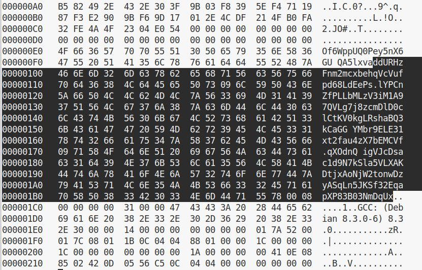
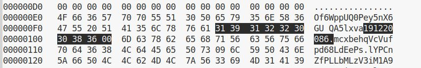
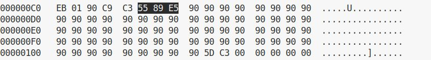
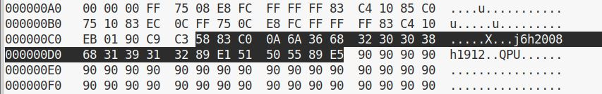
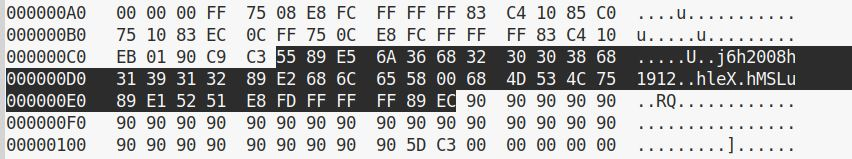
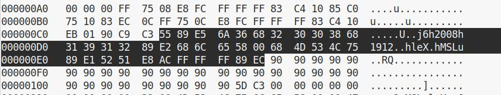
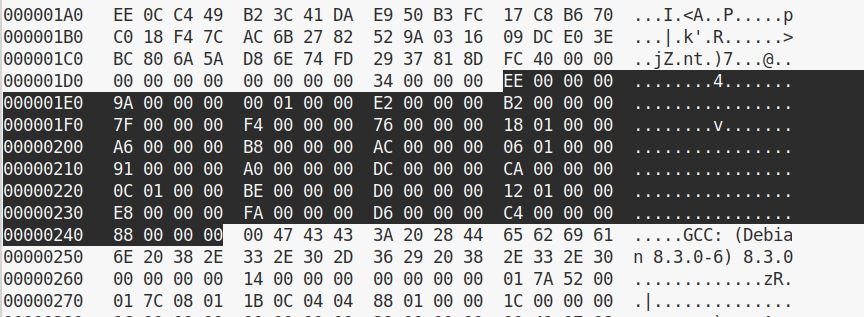

# linklab实验记录

实验环境：debian-10.5.0-i386-netinst虚拟机

参考书目：

​	1.《计算机系统基础（第2版）》（袁春风、余子濠 编著）第4章

​	2.《深入理解计算机系统（原书第3版）》第7章

网络课程参考：中国大学MOOC——计算机系统基础（四）：编程与调试实践

[TOC]

### 修改ELF文件的工具：hexedit

安装：`sudo apt-get install hexedit`

用户手册：`man hexedit`


运行：`hexedit <filename>`

保存：`Ctrl+W`或`F2`

保存并退出：`Ctrl+X`

不保存直接退出：`Ctrl+C`


选择：`Ctrl+Space`

复制：`Esc-w`

粘贴：`Ctrl+Y`


光标向前移动一个字符，如果该字符进行过改动则将其复原：`Backspace`

撤销所有操作：`Ctrl+U`

向前/后搜索：`Ctrl+S`/`Ctrl+R`


## phase1 静态数据对象与ELF数据节

直接`gcc -no-pie -o lb1 main.o phase1.o`，然后`./lb1`，打印出来一串奇奇怪怪的东西：

```
ddURHzFnm2mcxbehqVcVufpd68LdEePs	lYPCnZfPLLbMLzV3iM1A97QVLg7j8zcmDlD0clCtKV0kgLRshaBQ3kCaGG YMbr9ELE31xt2fau4zX7bEMCVf	qXOdnQ igVJcDsac1d9N7kSla5VLXAKDtjxAoNjW2tonwDzyASqLn5JKSf32EqapXP83B03NmDqUx
```

不急着分析这个奇怪的字符串，我们先来研究一下从哪里可以找到这串东西，以此来粗略理解一下链接的原理。接下来我们会用多种方式来寻找这个字符串。

#### 方式1

反汇编一下刚刚链接生成的可执行程序lb1（`objdump -d lb1 > lb1.s`），发现do_phase函数做了这些事：

```assembly
080491a2 <do_phase>:
 80491a2:	55                   	push   %ebp
 80491a3:	89 e5                	mov    %esp,%ebp
 80491a5:	83 ec 08             	sub    $0x8,%esp
 80491a8:	b8 da c0 04 08       	mov    $0x804c0da,%eax
 80491ad:	83 ec 0c             	sub    $0xc,%esp
 80491b0:	50                   	push   %eax
 80491b1:	e8 7a fe ff ff       	call   8049030
```

最后的call的0x8049030是函数puts，先不去管它，我们来看`push %eax`把啥东西存到栈里去了（`gdb lb1`）：

```
(gdb) x /s 0x804c0da
0x804c0da <tqdzfNje+26>:	"ddURHzFnm2mcxbehqVcVufpd68LdEePs\tlYPCnZfPLLbMLzV3iM1A97QVLg7j8zcmDlD0clCtKV0kgLRshaBQ3kCaGG YMbr9ELE31xt2fau4zX7bEMCVf\tqXOdnQ igVJcDsac1d9N7kSla5VLXAKDtjxAoNjW2tonwDzyASqLn5JKSf32EqapXP83B03NmDqUx"
```

这样，我们大概知道phase1的代码干了这样一件事：调用puts函数，打印这个奇怪的字符串。

#### 方式2

用hexedit查看phase1.o，我们可以直接用肉眼找到那个奇怪的字符串：



#### 方式3

接下来我们从链接与符号解析的角度来找这个字符串。我们先反汇编一下phase1.o（`objdump -d phase1.o > phase1.s`），看看链接之前的do_phase函数：

```assembly
phase1.o:     file format elf32-i386


Disassembly of section .text:

00000000 <do_phase>:
   0:	55                   	push   %ebp
   1:	89 e5                	mov    %esp,%ebp
   3:	83 ec 08             	sub    $0x8,%esp
   6:	b8 9a 00 00 00       	mov    $0x9a,%eax
   b:	83 ec 0c             	sub    $0xc,%esp
   e:	50                   	push   %eax
   f:	e8 fc ff ff ff       	call   10 <do_phase+0x10>
  14:	83 c4 10             	add    $0x10,%esp
  17:	90                   	nop
  18:	c9                   	leave  
  19:	c3                   	ret 
```

和上文链接之后的do_phase函数的反汇编代码一比较，我们很容易就会产生两个疑问：

> *1*. 为什么call 10 <do_phase+0x10>是调用puts函数？这是如何定位的？
>
>  *2*. 为什么把0x9a入栈，作为puts函数的实参？这是如何定位到那个奇怪的字符串的？

要解决这两个问题，我们需要来看一下phase1.o的重定位信息（`readelf -r phase1.o`）：

```
Relocation section '.rel.text' at offset 0x354 contains 2 entries:
 Offset     Info    Type            Sym.Value  Sym. Name
00000007  00000301 R_386_32          00000000   .data
00000010  00000e02 R_386_PC32        00000000   puts

Relocation section '.rel.data' at offset 0x364 contains 2 entries:
 Offset     Info    Type            Sym.Value  Sym. Name
00000068  00000601 R_386_32          00000000   .rodata
00000160  00000d01 R_386_32          00000000   do_phase

Relocation section '.rel.eh_frame' at offset 0x374 contains 1 entry:
 Offset     Info    Type            Sym.Value  Sym. Name
00000020  00000202 R_386_PC32        00000000   .text
```

我们知道，.data节（数据节）中引用对应的重定位条目在.rel.data节中，.text节（代码节）中引用对应的重定位条目在.rel.text节中。我们所提出的两个问题都源于.text节中，因此我们只需要关注重定位信息表的.rel.text节。这个节里有两个条目，一个是关于符号puts的条目，一个是关于符号.data的条目。正好对应我们提出的两个疑问。我们接下来只对链接之前的文件进行分析，所以重定位表中的信息只是用来定位符号，而不是用来对重定位的过程进行分析（重定位的过程会在phase5中提及，这里不会涉及到）。

我们看Offset列。在.rel.text部分，Offset指的是相对.text节的偏移量。我们结合puts和.data两个条目来进行具体说明。

puts的Offset为0x10，所以它是在相对于.text节偏移量为0x10的地方被引用的。我们来看phase1.s中偏移量为0x10的字节所在的指令：

```
f:	e8 fc ff ff ff       	call   10 <do_phase+0x10>
```

从偏移量为0x10起的四个字节，所表示的值是-0x4。call指令的目标地址是相对地址，是下一条指令的偏移量加上它的操作数-0x4。下一条指令的偏移量为0x14，所以此处call指令的目标为0x10。这与puts的Offset值0x10是相互呼应的。

再来看.data条目，它Offset为0x7，所以它是在相对于.text节偏移量为0x7的地方被引用的。我们来看phase1.s中偏移量为0x7（相对.text节）的字节所在的指令：

```
6:	b8 9a 00 00 00       	mov    $0x9a,%eax
```

从偏移量为0x7起的四个字节，所表示的数是0x9a。所以此处表示的实际地址是0x9a加上重定位符号.data的偏移地址。`readelf -S phase1.o`，我们来看一下节头表。我们发现.data节在phase1.o中的偏移量（Off列）为0x60：

```
There are 14 section headers, starting at offset 0x3e0:

Section Headers:
  [Nr] Name              Type            Addr     Off    Size   ES Flg Lk Inf Al
  [ 0]                   NULL            00000000 000000 000000 00      0   0  0
  [ 1] .text             PROGBITS        00000000 000034 00001a 00  AX  0   0  1
  [ 2] .rel.text         REL             00000000 000354 000010 08   I 11   1  4
  [ 3] .data             PROGBITS        00000000 000060 000164 00  WA  0   0 32
  [ 4] .rel.data         REL             00000000 000364 000010 08   I 11   3  4
  [ 5] .bss              NOBITS          00000000 0001c4 000000 00  WA  0   0  1
  [ 6] .rodata           PROGBITS        00000000 0001c4 000002 00   A  0   0  1
  [ 7] .comment          PROGBITS        00000000 0001c6 00001d 01  MS  0   0  1
  [ 8] .note.GNU-stack   PROGBITS        00000000 0001e3 000000 00      0   0  1
  [ 9] .eh_frame         PROGBITS        00000000 0001e4 000038 00   A  0   0  4
  [10] .rel.eh_frame     REL             00000000 000374 000008 08   I 11   9  4
  [11] .symtab           SYMTAB          00000000 00021c 000100 10     12  12  4
  [12] .strtab           STRTAB          00000000 00031c 000038 00      0   0  1
  [13] .shstrtab         STRTAB          00000000 00037c 000063 00      0   0  1
Key to Flags:
  W (write), A (alloc), X (execute), M (merge), S (strings), I (info),
  L (link order), O (extra OS processing required), G (group), T (TLS),
  C (compressed), x (unknown), o (OS specific), E (exclude),
  p (processor specific)
```

所以此处表示的实际地址为0x60+0x9a=0xfa。我们回头看方式2中的图片，发现那个我们打印出来的东西的起始位置正好是0xfa，定位成功。

#### 方式4


这次我们来看符号表（`readelf -s phase1.o`），我们只需要关注.data节中的符号，即（Ndx=3）的条目：

```
Symbol table '.symtab' contains 16 entries:
   Num:    Value  Size Type    Bind   Vis      Ndx Name
     0: 00000000     0 NOTYPE  LOCAL  DEFAULT  UND 
     1: 00000000     0 FILE    LOCAL  DEFAULT  ABS phase1.c
     2: 00000000     0 SECTION LOCAL  DEFAULT    1 
     3: 00000000     0 SECTION LOCAL  DEFAULT    3 
     4: 00000000     0 SECTION LOCAL  DEFAULT    5 
     5: 00000000   104 OBJECT  LOCAL  DEFAULT    3 PJIvaY
     6: 00000000     0 SECTION LOCAL  DEFAULT    6 
     7: 00000080   223 OBJECT  LOCAL  DEFAULT    3 tqdzfNje
     8: 0000015f     1 OBJECT  LOCAL  DEFAULT    3 uJGbRo
     9: 00000000     0 SECTION LOCAL  DEFAULT    8 
    10: 00000000     0 SECTION LOCAL  DEFAULT    9 
    11: 00000000     0 SECTION LOCAL  DEFAULT    7 
    12: 00000068     4 OBJECT  GLOBAL DEFAULT    3 phase_id
    13: 00000000    26 FUNC    GLOBAL DEFAULT    1 do_phase
    14: 00000000     0 NOTYPE  GLOBAL DEFAULT  UND puts
    15: 00000160     4 OBJECT  GLOBAL DEFAULT    3 phase
```

在方式3中，我们从节头表里发现.data节在phase1.o文件中的偏移量为0x60。结合上面的符号表我们得知：

| 属于.data节的符号名 | 在.data节中的偏移量（Value） | 大小（Size） | 在phase1.o中的位置 |
| ------------------- | ---------------------------- | ------------ | ------------------ |
| PJIvaY              | 0x0                          | 0x68         | 0x60-0xc7          |
| tqdzfNje            | 0x80                         | 0xdf         | 0xe0-0x1be         |
| uJGbRo              | 0x15f                        | 0x1          | 0x1bf              |

以符号tqdzfNje为例，我们解释一下这张表格中的数据是如何得到的。我们可以根据符号表中的Value列得知该符号在.data节中的偏移量。再根据Size列又能得知该符号的大小，即它所占的字节数。符号表中Size列的值是以十进制的形式表示的，我们把它写成十六进制看起来更方便。在phase1.o中，该符号的首地址是该符号在.data节中的偏移量加上.data节在phase1.o中的偏移量。所以对于符号tqdzfNje而言，它在phase1.o中的首地址即0x80+0x60=0xe0。又因为该符号的大小为0xdf，所以它在phase1.o中的位置就是从0xe0开始的0xdf个字节，即0xe0-0x1be。

我们再来看方式1打印出来的东西：

```
(gdb) x /s 0x804c0da
0x804c0da <tqdzfNje+26>:	"ddURHzFnm2mcxbehqVcVufpd68LdEePs\tlYPCnZfPLLbMLzV3iM1A97QVLg7j8zcmDlD0clCtKV0kgLRshaBQ3kCaGG YMbr9ELE31xt2fau4zX7bEMCVf\tqXOdnQ igVJcDsac1d9N7kSla5VLXAKDtjxAoNjW2tonwDzyASqLn5JKSf32EqapXP83B03NmDqUx"
```

需要仔细关注的是这个：`<tqdzfNje+26>`。

这说明phase1打印的是符号`tqdzfNje`，但不是直接打印这个符号对应的东西，而是偏移了26（0x1a）个字节进行打印的。我们计算要打印的东西在phase1.o中的总偏移量：.data节在phase1.o中的偏移量+符号tqdzfNje相对于.data节的偏移量+打印字符串相对于tqdzfNje首地址的偏移量=0x60+0x80+0x1a=0xfa。这样，我们就又一次定位到了那个奇怪的字符串。


研究完这么多找那个奇怪字符串的方式，我们大致对链接的原理和符号解析有了一些概念，然后就可以开始解决phase1了。从打印出来的那个字符串的第一个字符开始，逐个修改学号每个数字对应的字符，最后加上00作为结束符，就完成了。




## phase2 指令与ELF代码节

这个阶段我们只能修改phase2.o的.text节内容。`objdump -d phase2.o > phase2.s`，查看phase2.o的反汇编代码，我们发现do_phase函数里面全是nop，那么很显然，这个阶段是要我们填充do_phase函数中的指令，从而打印出学号。

`gcc -no-pie -o lb2 main.o phase2.o`，`objdump -d lb2 > lb2.s`，我们先来研究一下链接之后main函数执行了些啥。

```assembly
08049182 <main>:
 8049182:	8d 4c 24 04          	lea    0x4(%esp),%ecx
 8049186:	83 e4 f0             	and    $0xfffffff0,%esp
 8049189:	ff 71 fc             	pushl  -0x4(%ecx)
 804918c:	55                   	push   %ebp
 804918d:	89 e5                	mov    %esp,%ebp
 804918f:	51                   	push   %ecx
 8049190:	83 ec 04             	sub    $0x4,%esp
 8049193:	a1 28 c0 04 08       	mov    0x804c028,%eax
 8049198:	85 c0                	test   %eax,%eax
 804919a:	74 09                	je     80491a5 <main+0x23>
 804919c:	a1 28 c0 04 08       	mov    0x804c028,%eax
 80491a1:	ff d0                	call   *%eax
 80491a3:	eb 10                	jmp    80491b5 <main+0x33>
 80491a5:	83 ec 0c             	sub    $0xc,%esp
 80491a8:	68 10 a1 04 08       	push   $0x804a110
 80491ad:	e8 8e fe ff ff       	call   8049040 <puts@plt>
 80491b2:	83 c4 10             	add    $0x10,%esp
 80491b5:	b8 00 00 00 00       	mov    $0x0,%eax
 80491ba:	8b 4d fc             	mov    -0x4(%ebp),%ecx
 80491bd:	c9                   	leave  
 80491be:	8d 61 fc             	lea    -0x4(%ecx),%esp
 80491c1:	c3                   	ret 
 
 ......
 
08049253 <do_phase>:
 8049253:	55                   	push   %ebp
 8049254:	89 e5                	mov    %esp,%ebp
 8049256:	90                   	nop
 ......
 8049296:	90                   	nop
 8049297:	5d                   	pop    %ebp
 8049298:	c3                   	ret  
```

经过一通gdb（`gdb lb2`），我们发现0x804c028这个地址上存放的是do_phase函数的地址0x8049253。也就是说，main函数会调用do_phase函数，然后jmp跳过下面的call puts，直接return。所以如果尝试`./lb2`，我们会发现这个程序啥也没打印。

分析完程序大体上的流程，我们开始着手解题。

#### 方法1

最简单的思路，我们修改do_phase函数的返回地址，让它不返回到main函数里的下一条指令jmp。我们设法让do_phase函数返回之后执行main函数里call puts的部分，把学号打印出来。

```assembly
 80491a8:	68 10 a1 04 08       	push   $0x804a110
 80491ad:	e8 8e fe ff ff       	call   8049040 <puts@plt>
```

闲来无事，我们看一下这个puts默认打印的东西是啥：

```
(gdb) x /s 0x804a110
0x804a110:	"Welcome to this small lab of linking. To begin lab, please link the relevant object module(s) with the main module."
```

这显然不是我们想要打印的学号。所以我们要在栈中提供好puts函数的实参，然后把do_phase函数的返回地址改为call puts指令的地址（0x80491ad）。

接下来我们来研究应该把攻击代码写到哪里。

先看一下节头表（`readelf -S phase2.o`），找到我们能修改的.text节：

```
There are 14 section headers, starting at offset 0x3b4:

Section Headers:
  [Nr] Name              Type            Addr     Off    Size   ES Flg Lk Inf Al
  [ 0]                   NULL            00000000 000000 000000 00      0   0  0
  [ 1] .text             PROGBITS        00000000 000034 0000d7 00  AX  0   0  1
  [ 2] .rel.text         REL             00000000 000308 000020 08   I 11   1  4
  [ 3] .data             PROGBITS        00000000 00010c 000008 00  WA  0   0  4
  [ 4] .rel.data         REL             00000000 000328 000010 08   I 11   3  4
  [ 5] .bss              NOBITS          00000000 000114 000000 00  WA  0   0  1
  [ 6] .rodata           PROGBITS        00000000 000114 00000a 00   A  0   0  1
  [ 7] .comment          PROGBITS        00000000 00011e 00001d 01  MS  0   0  1
  [ 8] .note.GNU-stack   PROGBITS        00000000 00013b 000000 00      0   0  1
  [ 9] .eh_frame         PROGBITS        00000000 00013c 000078 00   A  0   0  4
  [10] .rel.eh_frame     REL             00000000 000338 000018 08   I 11   9  4
  [11] .symtab           SYMTAB          00000000 0001b4 000110 10     12  10  4
  [12] .strtab           STRTAB          00000000 0002c4 000043 00      0   0  1
  [13] .shstrtab         STRTAB          00000000 000350 000063 00      0   0  1
Key to Flags:
  W (write), A (alloc), X (execute), M (merge), S (strings), I (info),
  L (link order), O (extra OS processing required), G (group), T (TLS),
  C (compressed), x (unknown), o (OS specific), E (exclude),
  p (processor specific)
```

再来看符号表（`readelf -s phase2.o`）：

```
Symbol table '.symtab' contains 17 entries:
   Num:    Value  Size Type    Bind   Vis      Ndx Name
     0: 00000000     0 NOTYPE  LOCAL  DEFAULT  UND 
     1: 00000000     0 FILE    LOCAL  DEFAULT  ABS phase2.c
     2: 00000000     0 SECTION LOCAL  DEFAULT    1 
     3: 00000000     0 SECTION LOCAL  DEFAULT    3 
     4: 00000000     0 SECTION LOCAL  DEFAULT    5 
     5: 00000000     0 SECTION LOCAL  DEFAULT    6 
     6: 00000061    48 FUNC    LOCAL  DEFAULT    1 kfSvKnbh
     7: 00000000     0 SECTION LOCAL  DEFAULT    8 
     8: 00000000     0 SECTION LOCAL  DEFAULT    9 
     9: 00000000     0 SECTION LOCAL  DEFAULT    7 
    10: 00000000     4 OBJECT  GLOBAL DEFAULT    3 phase_id
    11: 00000000    97 FUNC    GLOBAL DEFAULT    1 OOtZxJJdNH
    12: 00000000     0 NOTYPE  GLOBAL DEFAULT  UND strlen
    13: 00000000     0 NOTYPE  GLOBAL DEFAULT  UND strcmp
    14: 00000000     0 NOTYPE  GLOBAL DEFAULT  UND puts
    15: 00000091    70 FUNC    GLOBAL DEFAULT    1 do_phase
    16: 00000004     4 OBJECT  GLOBAL DEFAULT    3 phase
```

与phase1中方式4的计算方法相同，我们很快能定位到do_phase函数在phase2.o中的位置（0x34+0x91=0xc5）。

`hexedit phase2.o`：



因为攻击代码需要对main函数的栈帧进行操作，所以do_phase函数中保存%ebp旧值（main函数中%ebp的值）的代码是没有必要的，所以我们的攻击代码会把上图中选中的字节也覆盖掉。

现在我们用gdb调试，观察一下call do_phase之前的栈帧情况：

```
linux> gdb lb2
(gdb) b *0x80491a1
Breakpoint 1 at 0x80491a1
(gdb) r
Breakpoint 1, 0x080491a1 in main ()
(gdb) i r
eax            0x8049253           134517331
ecx            0xbffff380          -1073745024
edx            0xbffff3a4          -1073744988
ebx            0x0                 0
esp            0xbffff360          0xbffff360
ebp            0xbffff368          0xbffff368
esi            0xb7fb5000          -1208266752
edi            0xb7fb5000          -1208266752
eip            0x80491a1           0x80491a1 <main+31>
eflags         0x206               [ PF IF ]
cs             0x73                115
ss             0x7b                123
ds             0x7b                123
es             0x7b                123
fs             0x0                 0
gs             0x33                51
(gdb) x /24wx 0xbffff320
0xbffff320:	0x00000000	0xb7fb5000	0xb7e0ccb9	0xb7fb8588
0xbffff330:	0xb7fb5000	0xb7fb5000	0x00000000	0xb7e0cdfb
0xbffff340:	0xb7fb53fc	0x00040000	0x00000000	0x080492e3
0xbffff350:	0x00000001	0xbffff414	0xbffff41c	0x080492bb
0xbffff360:	0xb7fe6520	0xbffff380	0x00000000	0xb7df5b41
0xbffff370:	0xb7fb5000	0xb7fb5000	0x00000000	0xb7df5b41
(gdb) si
0x08049253 in do_phase ()
(gdb) i r
eax            0x8049253           134517331
ecx            0xbffff380          -1073745024
edx            0xbffff3a4          -1073744988
ebx            0x0                 0
esp            0xbffff35c          0xbffff35c
ebp            0xbffff368          0xbffff368
esi            0xb7fb5000          -1208266752
edi            0xb7fb5000          -1208266752
eip            0x8049253           0x8049253 <do_phase>
eflags         0x206               [ PF IF ]
cs             0x73                115
ss             0x7b                123
ds             0x7b                123
es             0x7b                123
fs             0x0                 0
gs             0x33                51
(gdb) x /24wx 0xbffff320
0xbffff320:	0x00000000	0xb7fb5000	0xb7e0ccb9	0xb7fb8588
0xbffff330:	0xb7fb5000	0xb7fb5000	0x00000000	0xb7e0cdfb
0xbffff340:	0xb7fb53fc	0x00040000	0x00000000	0x080492e3
0xbffff350:	0x00000001	0xbffff414	0xbffff41c	0x080491a3
0xbffff360:	0xb7fe6520	0xbffff380	0x00000000	0xb7df5b41
0xbffff370:	0xb7fb5000	0xb7fb5000	0x00000000	0xb7df5b41
```

然后我们来写汇编代码：

`vim a2_main.s`，然后在里面写入以下指令：

```assembly
pop    %eax           
add    $0xa,%eax     # change return address
push   $0x36
push   $0x38303032
push   $0x32313931   # push my id
mov    %esp,%ecx
push   %ecx          # push the starting address of my id
push   %eax          # push return address
push   %ebp          # original do_phase here
mov    %esp,%ebp
```

写完后保存并退出，然后`gcc -c a2_main.s`，`objdump -d a2_main.o`，得到攻击指令的机器码：

```assembly
a2_main.o:     file format elf32-i386


Disassembly of section .text:

00000000 <.text>:
   0:	58                   	pop    %eax
   1:	83 c0 0a             	add    $0xa,%eax
   4:	6a 36                	push   $0x36
   6:	68 32 30 30 38       	push   $0x38303032
   b:	68 31 39 31 32       	push   $0x32313931
  10:	89 e1                	mov    %esp,%ecx
  12:	51                   	push   %ecx
  13:	50                   	push   %eax
  14:	55                   	push   %ebp
  15:	89 e5                	mov    %esp,%ebp
```

然后`hexedit phase2.o`把攻击代码填进去：



`gcc -no-pie -o lb2m main.o phase2.o`，我们用gdb检查一下程序是不是按照我们预期的想法来执行的。

展示一下在执行完上述攻击代码后、在do_phase函数的nop全部执行完之前的栈的状态：

```
(gdb) si
0x0804926a in do_phase ()
(gdb) x /24wx 0xbffff320
0xbffff320:	0x00000000	0xb7fb5000	0xb7e0ccb9	0xb7fb8588
0xbffff330:	0xb7fb5000	0xb7fb5000	0x00000000	0xb7e0cdfb
0xbffff340:	0xb7fb53fc	0x00040000	0xbffff368	0x080491ad
0xbffff350:	0xbffff354	0x32313931	0x38303032	0x00000036
0xbffff360:	0xb7fe6520	0xbffff380	0x00000000	0xb7df5b41
0xbffff370:	0xb7fb5000	0xb7fb5000	0x00000000	0xb7df5b41
```

看起来没啥问题。` ./lb2m`，过关。

#### 方法2

phase2.o里面除了do_phase函数外，还有几个有着奇怪函数名的函数。因为这个阶段只能修改.text节，所以我们只关注有call puts的函数（否则的话我们可以修改重定位信息，使得我们可以在任意想要调用puts的位置进行调用。不过这样很麻烦，因为添加重定位条目会改变重定位表的大小，然后还要调整节头表内容等等一系列操作，几乎是在重构phase2.o）。

话不多说，先来看看这个函数。

链接之前（phase2.s）：

```assembly
00000061 <kfSvKnbh>:
  61:	55                   	push   %ebp
  62:	89 e5                	mov    %esp,%ebp
  64:	83 ec 08             	sub    $0x8,%esp
  67:	83 ec 08             	sub    $0x8,%esp
  6a:	68 02 00 00 00       	push   $0x2
  6f:	ff 75 08             	pushl  0x8(%ebp)
  72:	e8 fc ff ff ff       	call   73 <kfSvKnbh+0x12>
  77:	83 c4 10             	add    $0x10,%esp
  7a:	85 c0                	test   %eax,%eax
  7c:	75 10                	jne    8e <kfSvKnbh+0x2d>
  7e:	83 ec 0c             	sub    $0xc,%esp
  81:	ff 75 0c             	pushl  0xc(%ebp)
  84:	e8 fc ff ff ff       	call   85 <kfSvKnbh+0x24>
  89:	83 c4 10             	add    $0x10,%esp
  8c:	eb 01                	jmp    8f <kfSvKnbh+0x2e>
  8e:	90                   	nop
  8f:	c9                   	leave  
  90:	c3                   	ret    
```

链接之后（lb2.s）：

```assembly
08049223 <kfSvKnbh>:
 8049223:	55                   	push   %ebp
 8049224:	89 e5                	mov    %esp,%ebp
 8049226:	83 ec 08             	sub    $0x8,%esp
 8049229:	83 ec 08             	sub    $0x8,%esp
 804922c:	68 86 a1 04 08       	push   $0x804a186
 8049231:	ff 75 08             	pushl  0x8(%ebp)
 8049234:	e8 f7 fd ff ff       	call   8049030 <strcmp@plt>
 8049239:	83 c4 10             	add    $0x10,%esp
 804923c:	85 c0                	test   %eax,%eax
 804923e:	75 10                	jne    8049250 <kfSvKnbh+0x2d>
 8049240:	83 ec 0c             	sub    $0xc,%esp
 8049243:	ff 75 0c             	pushl  0xc(%ebp)
 8049246:	e8 f5 fd ff ff       	call   8049040 <puts@plt>
 804924b:	83 c4 10             	add    $0x10,%esp
 804924e:	eb 01                	jmp    8049251 <kfSvKnbh+0x2e>
 8049250:	90                   	nop
 8049251:	c9                   	leave  
 8049252:	c3                   	ret    
```

这个函数有两个参数，一个在地址0x8(%ebp)上，要和地址0x804a186上的东西进行比较，如果相同才能call puts；另一个参数在地址0xc(%ebp)上，作为puts的实参。

```
(gdb) x /s 0x804a186
0x804a186:	"MSLuleX"
(gdb) x /2wx 0x804a186
0x804a186:	0x754c534d	0x0058656c
```

这时候我们的目标已经非常清晰了：在do_phase函数中调用kfSvKnbh函数，并为它提供好参数。

不同于方法1，这次我们需要仔细地维护do_phase函数的栈帧。我们注意到do_phase函数在return之前用pop %ebp代替了leave指令（详见本文phase2开头处展示的代码），这成立的条件是%esp和%ebp的值相同。但是这次我们会改动%esp，所以我们需要在攻击代码的最后多加一条指令mov %ebp,%esp（注意，方法1不需要这么做，但是方法2不这么做就会引起Segmentation fault）。

在写攻击代码之前还有最后一个问题：怎么call kfSvKnbh？我们不能把链接后的kfSvKnbh函数的地址写进攻击代码，因为链接后的该函数的地址是对phase2.o中call的操作数进行重定位而得到的，而这个call的操作数怎么填写正是我们现在正在探讨的问题。

我们必须call这个函数的相对地址。 **相对地址=kfSvKnbh函数的地址-call指令的下一条指令的地址。** 但这个“call指令的下一条指令的地址”我们暂时确定不了，所以我们给call指令的操作数先随便写个值（只要保证call操作数的机器码大小为4字节即可），把攻击代码写完之后再用hexedit调整这个值。

```assembly
a2c.o:     file format elf32-i386


Disassembly of section .text:

00000000 <.text>:
   0:	6a 36                	push   $0x36
   2:	68 32 30 30 38       	push   $0x38303032
   7:	68 31 39 31 32       	push   $0x32313931
   c:	89 e2                	mov    %esp,%edx
   e:	68 6c 65 58 00       	push   $0x58656c
  13:	68 4d 53 4c 75       	push   $0x754c534d
  18:	89 e1                	mov    %esp,%ecx
  1a:	52                   	push   %edx
  1b:	51                   	push   %ecx
  1c:	e8 fd ff ff ff       	call   0x1e
  21:	89 ec                	mov    %ebp,%esp
```

把这些攻击指令机器码填到phase2.o里，然后`objdump -d phase2.o`（注：我们这次的攻击代码不覆盖do_phase中保存%ebp旧值的指令）：




```assembly
00000091 <do_phase>:
  91:	55                   	push   %ebp
  92:	89 e5                	mov    %esp,%ebp
  94:	6a 36                	push   $0x36
  96:	68 32 30 30 38       	push   $0x38303032
  9b:	68 31 39 31 32       	push   $0x32313931
  a0:	89 e2                	mov    %esp,%edx
  a2:	68 6c 65 58 00       	push   $0x58656c
  a7:	68 4d 53 4c 75       	push   $0x754c534d
  ac:	89 e1                	mov    %esp,%ecx
  ae:	52                   	push   %edx
  af:	51                   	push   %ecx
  b0:	e8 fd ff ff ff       	call   b2 <do_phase+0x21>
  b5:	89 ec                	mov    %ebp,%esp
  b7:	90                   	nop
  b8:	90                   	nop
......
```

我们发现“call指令的下一条指令的地址”是0xb5。这样我们就可以计算要call的相对地址了：0x61-0xb5=-0x54，所以call指令的操作数应该是0xffffffac。我们重新`hexedit phase2.o`：



然后就能call kfSvKnbh了（`objdump -d phase2.o`）：


```assembly
00000091 <do_phase>:
  91:	55                   	push   %ebp
  92:	89 e5                	mov    %esp,%ebp
  94:	6a 36                	push   $0x36
  96:	68 32 30 30 38       	push   $0x38303032
  9b:	68 31 39 31 32       	push   $0x32313931
  a0:	89 e2                	mov    %esp,%edx
  a2:	68 6c 65 58 00       	push   $0x58656c
  a7:	68 4d 53 4c 75       	push   $0x754c534d
  ac:	89 e1                	mov    %esp,%ecx
  ae:	52                   	push   %edx
  af:	51                   	push   %ecx
  b0:	e8 ac ff ff ff       	call   61 <kfSvKnbh>
  b5:	89 ec                	mov    %ebp,%esp
......
```

`gcc -no-pie -o lb2c main.o phase2.o`，` ./lb2c`，完工。

#### 方法3

按部就班调用kfSvKnbh被函数牵着鼻子走一向不是我的风格。本着能懒就懒的原则，我才懒得让它strcmp，直接call puts它不香嘛。所以下面来简单介绍一下直接jmp的流氓方法：

进入do_phase函数，先保存%ebp的旧值（这里可以看作是kfSvKnbh函数在保存%ebp的旧值，看到下面你就明白了）。接下来我们把学号push入栈，再把学号的首地址也push入栈，然后直接jmp到kfSvKnbh函数的call puts。打印完学号之后执行kfSvKnbh函数的leave和ret，返回地址是main函数调用do_phase函数的下一条指令的地址。

写攻击代码的过程和方法2大同小异。jmp指令的操作数和call一样，都是相对地址，所以确定jmp操作数的方法与方法2里确定call操作数的方法一模一样。这里我们直接展示hexedit完之后的phase2.o反汇编的结果：

```assembly
  84:	e8 fc ff ff ff       	call   85 <kfSvKnbh+0x24>
  89:	83 c4 10             	add    $0x10,%esp
  8c:	eb 01                	jmp    8f <kfSvKnbh+0x2e>
  8e:	90                   	nop
  8f:	c9                   	leave  
  90:	c3                   	ret    

00000091 <do_phase>:
  91:	55                   	push   %ebp
  92:	89 e5                	mov    %esp,%ebp
  94:	6a 36                	push   $0x36
  96:	68 32 30 30 38       	push   $0x38303032
  9b:	68 31 39 31 32       	push   $0x32313931
  a0:	89 e0                	mov    %esp,%eax
  a2:	50                   	push   %eax
  a3:	e9 dc ff ff ff       	jmp    84 <kfSvKnbh+0x23>
  a8:	90                   	nop
  a9:	90                   	nop
```

`gcc -no-pie -o lb2j main.o phase2.o`，` ./lb2j`，大功告成。

#### 方法n

前面几种方法都是修改do_phase函数中的代码。其实我们还可以修改另外几个奇怪函数的代码，在几个函数之间jmp来jmp去，反正最终只要到达打印学号的效果就好了。所有方法本质上都是在一个合适的地方把学号push入栈，然后跳转到call puts的指令处进行打印。我们所要做的工作就是维护好函数的栈帧，仅此而已。


## phase3 符号解析

`gcc -no-pie -o lb3 main.o phase3.o`，`objdump -d lb3 > lb3.s`。先来看一下do_phase函数：


```assembly
080491b2 <do_phase>:
 80491b2:	55                   	push   %ebp
 80491b3:	89 e5                	mov    %esp,%ebp
 80491b5:	83 ec 18             	sub    $0x18,%esp
 80491b8:	c7 45 ea 79 7a 67 69 	movl   $0x69677a79,-0x16(%ebp)
 80491bf:	c7 45 ee 75 68 6e 62 	movl   $0x626e6875,-0x12(%ebp)
 80491c6:	66 c7 45 f2 65 00    	movw   $0x65,-0xe(%ebp)
 80491cc:	c7 45 f4 00 00 00 00 	movl   $0x0,-0xc(%ebp)
 80491d3:	eb 28                	jmp    80491fd <do_phase+0x4b>
 80491d5:	8d 55 ea             	lea    -0x16(%ebp),%edx
 80491d8:	8b 45 f4             	mov    -0xc(%ebp),%eax
 80491db:	01 d0                	add    %edx,%eax
 80491dd:	0f b6 00             	movzbl (%eax),%eax
 80491e0:	0f b6 c0             	movzbl %al,%eax
 80491e3:	0f b6 80 60 c0 04 08 	movzbl 0x804c060(%eax),%eax
 80491ea:	0f be c0             	movsbl %al,%eax
 80491ed:	83 ec 0c             	sub    $0xc,%esp
 80491f0:	50                   	push   %eax
 80491f1:	e8 5a fe ff ff       	call   8049050 <putchar@plt>
 80491f6:	83 c4 10             	add    $0x10,%esp
 80491f9:	83 45 f4 01          	addl   $0x1,-0xc(%ebp)
 80491fd:	8b 45 f4             	mov    -0xc(%ebp),%eax
 8049200:	83 f8 08             	cmp    $0x8,%eax
 8049203:	76 d0                	jbe    80491d5 <do_phase+0x23>
 8049205:	83 ec 0c             	sub    $0xc,%esp
 8049208:	6a 0a                	push   $0xa
 804920a:	e8 41 fe ff ff       	call   8049050 <putchar@plt>
 804920f:	83 c4 10             	add    $0x10,%esp
 8049212:	90                   	nop
 8049213:	c9                   	leave  
 8049214:	c3                   	ret
```

我们来分析一下do_phase函数做了些啥。这个函数先是把9个字节的信息放入了栈里，然后进入一个循环次数为9的循环。对于刚刚那9个字节的信息，每次循环会从中取出1个字节的信息，第x次循环就是取第x个字节的信息。然后将这个第x个字节的信息作为一个char数组的索引，得到一个char字符，并调用putchar函数将其打印出来。

我们用gdb调试一下，边调试边解释上面这段话的意思：

```
(gdb) b *0x80491d5
Breakpoint 1 at 0x80491d5
(gdb) r
Breakpoint 1, 0x080491d5 in do_phase ()
(gdb) i r
eax            0x0                 0
ecx            0xbffff380          -1073745024
edx            0xbffff3a4          -1073744988
ebx            0x0                 0
esp            0xbffff340          0xbffff340
ebp            0xbffff358          0xbffff358
esi            0xb7fb5000          -1208266752
edi            0xb7fb5000          -1208266752
eip            0x80491d5           0x80491d5 <do_phase+35>
eflags         0x293               [ CF AF SF IF ]
cs             0x73                115
ss             0x7b                123
ds             0x7b                123
es             0x7b                123
fs             0x0                 0
gs             0x33                51
(gdb) x /9bx 0xbffff342
0xbffff342:	0x79	0x7a	0x67	0x69	0x75	0x68	0x6e	0x62
0xbffff34a:	0x65
```

%ebp的值是0xbffff358，所以9个字节的信息的起始位置是%ebp-0x16=0xbffff342，用x命令打印如上。

第1次循环，循环变量i（位于%ebp-0xc处）的值为0，程序把地址%ebp-0x16+i处的值放到%eax里：

```assembly
 80491d5:	8d 55 ea             	lea    -0x16(%ebp),%edx
 80491d8:	8b 45 f4             	mov    -0xc(%ebp),%eax
 80491db:	01 d0                	add    %edx,%eax
 80491dd:	0f b6 00             	movzbl (%eax),%eax
 80491e0:	0f b6 c0             	movzbl %al,%eax
```

```
(gdb) b *0x80491e3
(gdb) c
Breakpoint 2, 0x80491e3 in do_phase ()
(gdb) p /x $eax
$1 = 0x79
```

然后程序把%eax中的值0x79作为索引，取出char数组中第0x79个元素，调用putchar函数把它打印出来。

这个char数组的首地址是0x804c060。我们用gdb查看一下这个数组：

```
(gdb) x /72wx 0x804c060
0x804c060 <NQqPQyqUth>:	0x00000000	0x00000000	0x00000000	0x00000000
0x804c070 <NQqPQyqUth+16>:	0x00000000	0x00000000	0x00000000	0x00000000
0x804c080 <NQqPQyqUth+32>:	0x00000000	0x00000000	0x00000000	0x00000000
0x804c090 <NQqPQyqUth+48>:	0x00000000	0x00000000	0x00000000	0x00000000
0x804c0a0 <NQqPQyqUth+64>:	0x00000000	0x00000000	0x00000000	0x00000000
0x804c0b0 <NQqPQyqUth+80>:	0x00000000	0x00000000	0x00000000	0x00000000
0x804c0c0 <NQqPQyqUth+96>:	0x00000000	0x00000000	0x00000000	0x00000000
0x804c0d0 <NQqPQyqUth+112>:	0x00000000	0x00000000	0x00000000	0x00000000
0x804c0e0 <NQqPQyqUth+128>:	0x00000000	0x00000000	0x00000000	0x00000000
0x804c0f0 <NQqPQyqUth+144>:	0x00000000	0x00000000	0x00000000	0x00000000
0x804c100 <NQqPQyqUth+160>:	0x00000000	0x00000000	0x00000000	0x00000000
0x804c110 <NQqPQyqUth+176>:	0x00000000	0x00000000	0x00000000	0x00000000
0x804c120 <NQqPQyqUth+192>:	0x00000000	0x00000000	0x00000000	0x00000000
0x804c130 <NQqPQyqUth+208>:	0x00000000	0x00000000	0x00000000	0x00000000
0x804c140 <NQqPQyqUth+224>:	0x00000000	0x00000000	0x00000000	0x00000000
0x804c150 <NQqPQyqUth+240>:	0x00000000	0x00000000	0x00000000	0x00000000
0x804c160:	0x00000000	0x00000000	0x00000000	0x00000000
0x804c170:	0x00000000	0x00000000	0x00000000	0x00000000
```

我们发现这个数组大小是256（0x100），里面的元素都是0。所以打印出来的东西是一片空白。

下一次循环也是同样的过程，我们不再继续调试。do_phase函数的逻辑就是这么简单，我们把这个逻辑用c代码重写如下：

```c
char NQqPQyqUth[256];
void do_phase() {
  int i = 0;
  char cookie[10] = {0x79,0x7a,0x67,0x69,0x75,0x68,0x6e,0x62,0x65,'\0'};
  for (; i <= 8; ++i) putchar(NQqPQyqUth[cookie[i]]);
  putchar('\n');
}
```

到这里我们大概知道这个阶段要干些啥了：新建一个phase3_patch.o，定义一个赋有初始值的强符号NQqPQyqUth，使得phase3.o中的弱符号NQqPQyqUth能够引用phase3_patch.o中的NQqPQyqUth。这样，我们就能在phase3_patch.o中给NQqPQyqUth赋上合适的值，使其能在执行do_phase函数时根据索引值打印字符数组NQqPQyqUth中的某些元素，所有打印出来的内容连起来就是我们想要的学号。

`readelf -s phase3.o`，我们先来看看这个phase3.o中的弱符号：

```
Symbol table '.symtab' contains 14 entries:
   Num:    Value  Size Type    Bind   Vis      Ndx Name
     0: 00000000     0 NOTYPE  LOCAL  DEFAULT  UND 
     1: 00000000     0 FILE    LOCAL  DEFAULT  ABS phase3.c
     2: 00000000     0 SECTION LOCAL  DEFAULT    1 
     3: 00000000     0 SECTION LOCAL  DEFAULT    3 
     4: 00000000     0 SECTION LOCAL  DEFAULT    5 
     5: 00000000     0 SECTION LOCAL  DEFAULT    6 
     6: 00000000     0 SECTION LOCAL  DEFAULT    8 
     7: 00000000     0 SECTION LOCAL  DEFAULT    9 
     8: 00000000     0 SECTION LOCAL  DEFAULT    7 
     9: 00000000     4 OBJECT  GLOBAL DEFAULT    3 phase_id
    10: 00000020   256 OBJECT  GLOBAL DEFAULT  COM NQqPQyqUth
    11: 00000000    99 FUNC    GLOBAL DEFAULT    1 do_phase
    12: 00000000     0 NOTYPE  GLOBAL DEFAULT  UND putchar
    13: 00000004     4 OBJECT  GLOBAL DEFAULT    3 phase
```

我们看到弱符号NQqPQyqUth的类型为为COMMON，表示还未被分配位置的未初始化的数据目标。对于COMMON符号，Value字段给出对齐要求，Size给出最小的大小。从符号表中我们可以看出，NQqPQyqUth的最小大小是256，正好符合我们用gdb调试出来的结果。

接着我们来定义这个弱符号所要引用的强符号。我们新建一个.c文件（`vim phase3_patch.c`），只需要写一行代码：

```c
char NQqPQyqUth[256] = "1";
```

然后`gcc -c phase3_patch.c`，生成.o文件。

我们来看看这个补丁文件的节头表和符号表：

`readelf -S phase3_patch.o`

```
There are 9 section headers, starting at offset 0x238:

Section Headers:
  [Nr] Name              Type            Addr     Off    Size   ES Flg Lk Inf Al
  [ 0]                   NULL            00000000 000000 000000 00      0   0  0
  [ 1] .text             PROGBITS        00000000 000034 000000 00  AX  0   0  1
  [ 2] .data             PROGBITS        00000000 000040 000100 00  WA  0   0 32
  [ 3] .bss              NOBITS          00000000 000140 000000 00  WA  0   0  1
  [ 4] .comment          PROGBITS        00000000 000140 00001d 01  MS  0   0  1
  [ 5] .note.GNU-stack   PROGBITS        00000000 00015d 000000 00      0   0  1
  [ 6] .symtab           SYMTAB          00000000 000160 000080 10      7   7  4
  [ 7] .strtab           STRTAB          00000000 0001e0 000011 00      0   0  1
  [ 8] .shstrtab         STRTAB          00000000 0001f1 000045 00      0   0  1
Key to Flags:
  W (write), A (alloc), X (execute), M (merge), S (strings), I (info),
  L (link order), O (extra OS processing required), G (group), T (TLS),
  C (compressed), x (unknown), o (OS specific), E (exclude),
  p (processor specific)
```

`readelf -s phase3_patch.o`

```
Symbol table '.symtab' contains 8 entries:
   Num:    Value  Size Type    Bind   Vis      Ndx Name
     0: 00000000     0 NOTYPE  LOCAL  DEFAULT  UND 
     1: 00000000     0 FILE    LOCAL  DEFAULT  ABS a3.c
     2: 00000000     0 SECTION LOCAL  DEFAULT    1 
     3: 00000000     0 SECTION LOCAL  DEFAULT    2 
     4: 00000000     0 SECTION LOCAL  DEFAULT    3 
     5: 00000000     0 SECTION LOCAL  DEFAULT    5 
     6: 00000000     0 SECTION LOCAL  DEFAULT    4 
     7: 00000000   256 OBJECT  GLOBAL DEFAULT    2 NQqPQyqUth
```

好了，现在我们知道，.data节在phase3_patch.o中的偏移量为0x40，符号NQqPQyqUth在.data节中的偏移量为0x0。所以符号NQqPQyqUth在phase3_patch.o中的偏移量为0x40+0x0=0x40。又因为符号NQqPQyqUth的大小为256（0x100），所以它的内容在位置0x40\~0x13f上。

`hexedit phase3_patch.o`。因为我们给这个强符号赋的初值为字符串"1"，所以位置0x40上的值是31，其余255个位置的值上都是0：

```
00000040   31 00 00 00  00 00 00 00  00 00 00 00  00 00 00 00  1...............
00000050   00 00 00 00  00 00 00 00  00 00 00 00  00 00 00 00  ................
00000060   00 00 00 00  00 00 00 00  00 00 00 00  00 00 00 00  ................
00000070   00 00 00 00  00 00 00 00  00 00 00 00  00 00 00 00  ................
00000080   00 00 00 00  00 00 00 00  00 00 00 00  00 00 00 00  ................
00000090   00 00 00 00  00 00 00 00  00 00 00 00  00 00 00 00  ................
000000A0   00 00 00 00  00 00 00 00  00 00 00 00  00 00 00 00  ................
000000B0   00 00 00 00  00 00 00 00  00 00 00 00  00 00 00 00  ................
000000C0   00 00 00 00  00 00 00 00  00 00 00 00  00 00 00 00  ................
000000D0   00 00 00 00  00 00 00 00  00 00 00 00  00 00 00 00  ................
000000E0   00 00 00 00  00 00 00 00  00 00 00 00  00 00 00 00  ................
000000F0   00 00 00 00  00 00 00 00  00 00 00 00  00 00 00 00  ................
00000100   00 00 00 00  00 00 00 00  00 00 00 00  00 00 00 00  ................
00000110   00 00 00 00  00 00 00 00  00 00 00 00  00 00 00 00  ................
00000120   00 00 00 00  00 00 00 00  00 00 00 00  00 00 00 00  ................
00000130   00 00 00 00  00 00 00 00  00 00 00 00  00 00 00 00  ................
```

回想一下do_phase函数的功能，参看那个我们还原出的c代码。想要把学号打印出来，那么就需要把cookie数组（`{0x79,0x7a,0x67,0x69,0x75,0x68,0x6e,0x62,0x65}`）中的每一个元素加上0x40之后对应的位置上的值依次改为我们的学号：

```
00000040   31 00 00 00  00 00 00 00  00 00 00 00  00 00 00 00  1...............
00000050   00 00 00 00  00 00 00 00  00 00 00 00  00 00 00 00  ................
00000060   00 00 00 00  00 00 00 00  00 00 00 00  00 00 00 00  ................
00000070   00 00 00 00  00 00 00 00  00 00 00 00  00 00 00 00  ................
00000080   00 00 00 00  00 00 00 00  00 00 00 00  00 00 00 00  ................
00000090   00 00 00 00  00 00 00 00  00 00 00 00  00 00 00 00  ................
000000A0   00 00 38 00  00 36 00 31  30 32 00 00  00 00 30 00  ..8..6.102....0.
000000B0   00 00 00 00  00 32 00 00  00 31 39 00  00 00 00 00  .....2...19.....
000000C0   00 00 00 00  00 00 00 00  00 00 00 00  00 00 00 00  ................
000000D0   00 00 00 00  00 00 00 00  00 00 00 00  00 00 00 00  ................
000000E0   00 00 00 00  00 00 00 00  00 00 00 00  00 00 00 00  ................
000000F0   00 00 00 00  00 00 00 00  00 00 00 00  00 00 00 00  ................
00000100   00 00 00 00  00 00 00 00  00 00 00 00  00 00 00 00  ................
00000110   00 00 00 00  00 00 00 00  00 00 00 00  00 00 00 00  ................
00000120   00 00 00 00  00 00 00 00  00 00 00 00  00 00 00 00  ................
00000130   00 00 00 00  00 00 00 00  00 00 00 00  00 00 00 00  ................
```

`gcc -no-pie -o lb3 main.o phase3.o phase3_patch.o`，`./lb3`，搞定。


## phase4 switch语句与重定位

这个阶段的do_phase函数和上一阶段的差不多，都是一个循环9次的循环。这里贴一下反汇编看得清楚一点（`gcc -no-pie -o lb4 main.o phase4.o`，`objdump -d lb4 > lb4.s`）：

```assembly
080491cb <do_phase>:
 80491cb:	55                   	push   %ebp
 80491cc:	89 e5                	mov    %esp,%ebp
 80491ce:	83 ec 28             	sub    $0x28,%esp
 80491d1:	c7 45 e6 53 4e 58 47 	movl   $0x47584e53,-0x1a(%ebp)
 80491d8:	c7 45 ea 4a 54 43 46 	movl   $0x4643544a,-0x16(%ebp)
 80491df:	66 c7 45 ee 50 00    	movw   $0x50,-0x12(%ebp)
 80491e5:	c7 45 f0 00 00 00 00 	movl   $0x0,-0x10(%ebp)
 80491ec:	e9 e0 00 00 00       	jmp    80492d1 <do_phase+0x106>
 80491f1:	8d 55 e6             	lea    -0x1a(%ebp),%edx
 80491f4:	8b 45 f0             	mov    -0x10(%ebp),%eax
 80491f7:	01 d0                	add    %edx,%eax
 80491f9:	0f b6 00             	movzbl (%eax),%eax
 80491fc:	88 45 f7             	mov    %al,-0x9(%ebp)
 80491ff:	0f be 45 f7          	movsbl -0x9(%ebp),%eax
 8049203:	83 e8 41             	sub    $0x41,%eax
 8049206:	83 f8 19             	cmp    $0x19,%eax
 8049209:	0f 87 b0 00 00 00    	ja     80492bf <do_phase+0xf4>
 804920f:	8b 04 85 88 a1 04 08 	mov    0x804a188(,%eax,4),%eax
 8049216:	ff e0                	jmp    *%eax
 8049218:	c6 45 f7 38          	movb   $0x38,-0x9(%ebp)
 804921c:	e9 9e 00 00 00       	jmp    80492bf <do_phase+0xf4>
 8049221:	c6 45 f7 65          	movb   $0x65,-0x9(%ebp)
 8049225:	e9 95 00 00 00       	jmp    80492bf <do_phase+0xf4>
  /*这里省略20多个跳转表项*/
 80492b4:	c6 45 f7 34          	movb   $0x34,-0x9(%ebp)
 80492b8:	eb 05                	jmp    80492bf <do_phase+0xf4>
 80492ba:	c6 45 f7 67          	movb   $0x67,-0x9(%ebp)
 80492be:	90                   	nop
 80492bf:	8d 55 dc             	lea    -0x24(%ebp),%edx
 80492c2:	8b 45 f0             	mov    -0x10(%ebp),%eax
 80492c5:	01 c2                	add    %eax,%edx
 80492c7:	0f b6 45 f7          	movzbl -0x9(%ebp),%eax
 80492cb:	88 02                	mov    %al,(%edx)
 80492cd:	83 45 f0 01          	addl   $0x1,-0x10(%ebp)
 80492d1:	8b 45 f0             	mov    -0x10(%ebp),%eax
 80492d4:	83 f8 08             	cmp    $0x8,%eax
 80492d7:	0f 86 14 ff ff ff    	jbe    80491f1 <do_phase+0x26>
 80492dd:	8d 55 dc             	lea    -0x24(%ebp),%edx
 80492e0:	8b 45 f0             	mov    -0x10(%ebp),%eax
 80492e3:	01 d0                	add    %edx,%eax
 80492e5:	c6 00 00             	movb   $0x0,(%eax)
 80492e8:	83 ec 0c             	sub    $0xc,%esp
 80492eb:	8d 45 dc             	lea    -0x24(%ebp),%eax
 80492ee:	50                   	push   %eax
 80492ef:	e8 3c fd ff ff       	call   8049030 <puts@plt>
 80492f4:	83 c4 10             	add    $0x10,%esp
 80492f7:	90                   	nop
 80492f8:	c9                   	leave  
 80492f9:	c3                   	ret
```

因为和phase3的分析过程类似，所以我们就不展示用gdb分析函数逻辑的过程了。直接上还原出来的c代码：

```c
void do_phase() {
  char data;
  int i = 0;
  char cookie[10] = {0x53,0x4e,0x58,0x47,0x4a,0x54,0x43,0x46,0x50,'\0'};
  char output[10];
  for (; i <= 8; ++i) {
    switch(cookie[i]-0x41){
      /*
      case x: data = some value; break;
      (The range of x is from 0 to 19.)
      */
      default: break;
    }
    output[i] = data;
  }
  output[i] = '\0';
  puts(output);
}
```

其中output的首地址是%ebp-0x24，cookie的首地址是%ebp-0x1a。i存放在地址%ebp-0x10上，data存放在地址%ebp-0x9上。

和switch相关的反汇编代码是这些，我们重新把它贴一下：

```assembly
 8049203:	83 e8 41             	sub    $0x41,%eax
 8049206:	83 f8 19             	cmp    $0x19,%eax
 8049209:	0f 87 b0 00 00 00    	ja     80492bf <do_phase+0xf4>
 804920f:	8b 04 85 88 a1 04 08 	mov    0x804a188(,%eax,4),%eax
 8049216:	ff e0                	jmp    *%eax
 8049218:	c6 45 f7 38          	movb   $0x38,-0x9(%ebp)
 804921c:	e9 9e 00 00 00       	jmp    80492bf <do_phase+0xf4>
 8049221:	c6 45 f7 65          	movb   $0x65,-0x9(%ebp)
 8049225:	e9 95 00 00 00       	jmp    80492bf <do_phase+0xf4>
 /*这里省略20多个跳转表项*/
 80492b4:	c6 45 f7 34          	movb   $0x34,-0x9(%ebp)
 80492b8:	eb 05                	jmp    80492bf <do_phase+0xf4>
 80492ba:	c6 45 f7 67          	movb   $0x67,-0x9(%ebp)
 80492be:	90                   	nop
```

%eax存放的是cookie[i]的值，它先减去0x41，然后和0x19比较。如果它大于0x19，那么就执行default语句的内容，否则就跳转到对应的表项执行相应的case语句。

我们用gdb看一下这个跳转表：

```
(gdb) x /26wx 0x804a188
0x804a188:	0x08049290	0x0804923c	0x080492a2	0x08049284
0x804a198:	0x08049254	0x08049221	0x08049296	0x08049218
0x804a1a8:	0x080492ba	0x08049248	0x0804925a	0x0804924e
0x804a1b8:	0x080492a8	0x08049233	0x08049242	0x0804927e
0x804a1c8:	0x0804926c	0x080492ae	0x08049260	0x08049272
0x804a1d8:	0x080492b4	0x0804928a	0x0804929c	0x08049278
0x804a1e8:	0x08049266	0x0804922a
```

这下我们完全明白这个函数的执行过程了。举个例子来说明：比如第8次循环的时候，取cookie[7]=0x46。然后switch(0x46-0x41)，执行case 5。如何跳转到case 5呢？我们看到跳转表的首地址是0x804a188，0x804a188+4*0x5=0x804a19c。所以我们取地址0x804a19c上的值0x08049221，jmp到这里继续执行。这里就是case 5要执行的代码。

接下来开始着手解决phase4。因为这个阶段不允许修改.text节和重定位节的内容，所以我们只能从修改跳转表的角度考虑。开关语句的跳转表是存放在.rodata节（只读数据节）的。

`readelf -S phase4.o`，我们发现.rodata节的偏移量是0x1d8：

```
There are 15 section headers, starting at offset 0x548:

Section Headers:
  [Nr] Name              Type            Addr     Off    Size   ES Flg Lk Inf Al
  [ 0]                   NULL            00000000 000000 000000 00      0   0  0
  [ 1] .text             PROGBITS        00000000 000034 000158 00  AX  0   0  1
  [ 2] .rel.text         REL             00000000 0003e0 000010 08   I 12   1  4
  [ 3] .data             PROGBITS        00000000 0001a0 000038 00  WA  0   0 32
  [ 4] .rel.data         REL             00000000 0003f0 000010 08   I 12   3  4
  [ 5] .bss              NOBITS          00000000 0001d8 000000 00  WA  0   0  1
  [ 6] .rodata           PROGBITS        00000000 0001d8 00006c 00   A  0   0  4
  [ 7] .rel.rodata       REL             00000000 000400 0000d0 08   I 12   6  4
  [ 8] .comment          PROGBITS        00000000 000244 00001d 01  MS  0   0  1
  [ 9] .note.GNU-stack   PROGBITS        00000000 000261 000000 00      0   0  1
  [10] .eh_frame         PROGBITS        00000000 000264 000058 00   A  0   0  4
  [11] .rel.eh_frame     REL             00000000 0004d0 000010 08   I 12  10  4
  [12] .symtab           SYMTAB          00000000 0002bc 0000f0 10     13  11  4
  [13] .strtab           STRTAB          00000000 0003ac 000033 00      0   0  1
  [14] .shstrtab         STRTAB          00000000 0004e0 000067 00      0   0  1
Key to Flags:
  W (write), A (alloc), X (execute), M (merge), S (strings), I (info),
  L (link order), O (extra OS processing required), G (group), T (TLS),
  C (compressed), x (unknown), o (OS specific), E (exclude),
  p (processor specific)
```

再来看phase4.o的反汇编代码（`objdump -d phase4.o > phase4.s`）。注意偏移量（相对.text节）为0x6d的那一行，它告诉我们跳转表相对于.rodata节的偏移量为0x4：

```assembly
  61:	83 e8 41             	sub    $0x41,%eax
  64:	83 f8 19             	cmp    $0x19,%eax
  67:	0f 87 b0 00 00 00    	ja     11d <do_phase+0xf4>
  6d:	8b 04 85 04 00 00 00 	mov    0x4(,%eax,4),%eax
  74:	ff e0                	jmp    *%eax
  76:	c6 45 f7 38          	movb   $0x38,-0x9(%ebp)
  7a:	e9 9e 00 00 00       	jmp    11d <do_phase+0xf4>
  7f:	c6 45 f7 65          	movb   $0x65,-0x9(%ebp)
  83:	e9 95 00 00 00       	jmp    11d <do_phase+0xf4>
 /*这里省略20多个跳转表项*/
 112:	c6 45 f7 34          	movb   $0x34,-0x9(%ebp)
 116:	eb 05                	jmp    11d <do_phase+0xf4>
 118:	c6 45 f7 67          	movb   $0x67,-0x9(%ebp)
 11c:	90                   	nop
```

因此，跳转表的起始位置为0x1d8+0x4=0x1dc。我们用`hexedit phase4.o`查看这个跳转表：



和前面用gdb调试可执行文件lb4时看到的跳转表相比，不同的只是跳转的绝对地址，而跳转的相对地址是一样的。

接下来我们针对cookie数组（`{0x53,0x4e,0x58,0x47,0x4a,0x54,0x43,0x46,0x50}`）的每一个元素，追踪到跳转表对应的表项，进行修改，使得最终打印出来的是我们的学号。

还是拿第8次循环作为例子。我们取到cookie[7]=0x46。0x1dc+4*(0x46-0x41) = 0x1f0。在`hexedit phase4.o`中我们找到地址0x1f0，它对应的值是7f。这表示这次循环中，执行switch所跳转表项的内容相对于.text节的偏移量为0x7f。所以我们到phase4.s中寻找偏移量为0x7f的指令，发现它本来是把0x65赋值给data。但是我们学号的第8个数字是8，所以应该把0x38赋给data。我们到phase4.s中找到这条指令，它的偏移量为0x76。所以我们需要`hexedit phase4.o`把地址0x1f0处的值修改为76。

同理修改其它8个跳转表项，完成之后`gcc -no-pie -o lb4 main.o phase4.o`，`./lb4`检查一下打印结果，完成。


## phase5 可重定位目标文件

这个阶段需要我们填写被人为清零的重定位条目。

关于如何阅读重定位条目这个问题，我们在phase1中粗略地描述了一下。现在我们来结合phase5的文件详细描述一下。

`readelf -S phase5.o`，节头表：

```
There are 15 section headers, starting at offset 0x9a8:

Section Headers:
  [Nr] Name              Type            Addr     Off    Size   ES Flg Lk Inf Al
  [ 0]                   NULL            00000000 000000 000000 00      0   0  0
  [ 1] .text             PROGBITS        00000000 000034 000272 00  AX  0   0  1
  [ 2] .rel.text         REL             00000000 0007f8 0000b8 08   I 12   1  4
  [ 3] .data             PROGBITS        00000000 0002c0 00011c 00  WA  0   0 32
  [ 4] .rel.data         REL             00000000 0008b0 000020 08   I 12   3  4
  [ 5] .bss              NOBITS          00000000 0003dc 000000 00  WA  0   0  1
  [ 6] .rodata           PROGBITS        00000000 0003e0 000100 00   A  0   0 32
  [ 7] .rel.rodata       REL             00000000 0008d0 000040 08   I 12   6  4
  [ 8] .comment          PROGBITS        00000000 0004e0 00001d 01  MS  0   0  1
  [ 9] .note.GNU-stack   PROGBITS        00000000 0004fd 000000 00      0   0  1
  [10] .eh_frame         PROGBITS        00000000 000500 0000d8 00   A  0   0  4
  [11] .rel.eh_frame     REL             00000000 000910 000030 08   I 12  10  4
  [12] .symtab           SYMTAB          00000000 0005d8 000190 10     13   9  4
  [13] .strtab           STRTAB          00000000 000768 00008f 00      0   0  1
  [14] .shstrtab         STRTAB          00000000 000940 000067 00      0   0  1
Key to Flags:
  W (write), A (alloc), X (execute), M (merge), S (strings), I (info),
  L (link order), O (extra OS processing required), G (group), T (TLS),
  C (compressed), x (unknown), o (OS specific), E (exclude),
  p (processor specific)
```

`readelf -s phase5.o`，符号表：

```
Symbol table '.symtab' contains 25 entries:
   Num:    Value  Size Type    Bind   Vis      Ndx Name
     0: 00000000     0 NOTYPE  LOCAL  DEFAULT  UND 
     1: 00000000     0 FILE    LOCAL  DEFAULT  ABS phase5.c
     2: 00000000     0 SECTION LOCAL  DEFAULT    1 
     3: 00000000     0 SECTION LOCAL  DEFAULT    3 
     4: 00000000     0 SECTION LOCAL  DEFAULT    5 
     5: 00000000     0 SECTION LOCAL  DEFAULT    6 
     6: 00000000     0 SECTION LOCAL  DEFAULT    9 
     7: 00000000     0 SECTION LOCAL  DEFAULT   10 
     8: 00000000     0 SECTION LOCAL  DEFAULT    8 
     9: 00000000   250 OBJECT  GLOBAL DEFAULT    3 ohMkhV
    10: 00000000    93 FUNC    GLOBAL DEFAULT    1 OOtZxJJdNH
    11: 000000fc     4 OBJECT  GLOBAL DEFAULT    3 phase_id
    12: 00000100    10 OBJECT  GLOBAL DEFAULT    3 tqdzfNje
    13: 00000020    52 OBJECT  GLOBAL DEFAULT    6 yAnKQn
    14: 0000010c     4 OBJECT  GLOBAL DEFAULT    3 aQSEth
    15: 0000005d   146 FUNC    GLOBAL DEFAULT    1 transform_code
    16: 000000ef    60 FUNC    GLOBAL DEFAULT    1 generate_code
    17: 00000080   128 OBJECT  GLOBAL DEFAULT    6 AycPNh
    18: 0000012b   136 FUNC    GLOBAL DEFAULT    1 encode_1
    19: 00000000     0 NOTYPE  GLOBAL DEFAULT  UND strlen
    20: 000001b3   135 FUNC    GLOBAL DEFAULT    1 encode_2
    21: 00000110     8 OBJECT  GLOBAL DEFAULT    3 encoder
    22: 0000023a    56 FUNC    GLOBAL DEFAULT    1 do_phase
    23: 00000000     0 NOTYPE  GLOBAL DEFAULT  UND puts
    24: 00000118     4 OBJECT  GLOBAL DEFAULT    3 phase
```

`readelf -r phase5.o`，重定位信息表：

```
Relocation section '.rel.text' at offset 0x7f8 contains 23 entries:
 Offset     Info    Type            Sym.Value  Sym. Name
00000066  00000d01 R_386_32          00000020   yAnKQn
00000075  00000501 R_386_32          00000000   .rodata
00000086  00000d01 R_386_32          00000020   yAnKQn
00000000  00000000 R_386_NONE       											     # need modification
00000000  00000000 R_386_NONE       										       # need modification
000000bd  00000d01 R_386_32          00000020   yAnKQn
000000cc  00000d01 R_386_32          00000020   yAnKQn
00000000  00000000 R_386_NONE       										       # need modification
000000f9  00000e01 R_386_32          0000010c   aQSEth
00000107  00000e01 R_386_32          0000010c   aQSEth
00000000  00000000 R_386_NONE       									         # need modification
00000118  00000e01 R_386_32          0000010c   aQSEth
00000138  00001302 R_386_PC32        00000000   strlen
00000000  00000000 R_386_NONE       									         # need modification
00000162  00000e01 R_386_32          0000010c   aQSEth
000001c0  00001302 R_386_PC32        00000000   strlen
000001e4  00001101 R_386_32          00000080   AycPNh
000001ea  00000e01 R_386_32          0000010c   aQSEth
00000246  00001002 R_386_PC32        000000ef   generate_code
00000000  00000000 R_386_NONE       												   # need modification
00000256  00000c01 R_386_32          00000100   tqdzfNje
00000000  00000000 R_386_NONE       											     # need modification
00000268  00001702 R_386_PC32        00000000   puts

Relocation section '.rel.data' at offset 0x8b0 contains 4 entries:
 Offset     Info    Type            Sym.Value  Sym. Name
000000fc  00000501 R_386_32          00000000   .rodata
00000110  00001201 R_386_32          0000012b   encode_1
00000114  00001401 R_386_32          000001b3   encode_2
00000118  00001601 R_386_32          0000023a   do_phase

Relocation section '.rel.rodata' at offset 0x8d0 contains 8 entries:
 Offset     Info    Type            Sym.Value  Sym. Name
00000054  00000201 R_386_32          00000000   .text
00000058  00000201 R_386_32          00000000   .text
0000005c  00000201 R_386_32          00000000   .text
00000060  00000201 R_386_32          00000000   .text
00000064  00000201 R_386_32          00000000   .text
00000068  00000201 R_386_32          00000000   .text
0000006c  00000201 R_386_32          00000000   .text
00000070  00000201 R_386_32          00000000   .text

Relocation section '.rel.eh_frame' at offset 0x910 contains 6 entries:
 Offset     Info    Type            Sym.Value  Sym. Name
00000020  00000202 R_386_PC32        00000000   .text
00000040  00000202 R_386_PC32        00000000   .text
00000060  00000202 R_386_PC32        00000000   .text
00000080  00000202 R_386_PC32        00000000   .text
000000a0  00000202 R_386_PC32        00000000   .text
000000c0  00000202 R_386_PC32        00000000   .text
```

这些表的内容这么多，我们该从哪里入手呢？不急，我们从重定位表开始一点一点研究。这个重定位表有好几个节，我们先来看.rel.text节的第一个条目。这个条目中的符号名（Sym. Name）为yAnKQn，该符号在其所在的节中的偏移量（Sym.Value）为0x20：

```
Relocation section '.rel.text' at offset 0x7f8 contains 23 entries:
 Offset     Info    Type            Sym.Value  Sym. Name
00000066  00000d01 R_386_32          00000020   yAnKQn
```

我们根据符号名到符号表中去寻找这个符号：

```
Symbol table '.symtab' contains 25 entries:
   Num:    Value  Size Type    Bind   Vis      Ndx Name
    13: 00000020    52 OBJECT  GLOBAL DEFAULT    6 yAnKQn
```

我们对比重定位表的表头和符号表的表头，发现重定位表中的Sym. Name对应着符号表中的Name；重定位表中的Sym. Value对应着符号表中的Value。原来两张表是有关联的！

我们继续看符号表中的这个条目。我们发现这个符号的大小为52（0x34），Ndx为6。Ndx的值表示这个符号属于节头表中的第Ndx个条目。我们再来看节头表：

```
Section Headers:
  [Nr] Name              Type            Addr     Off    Size   ES Flg Lk Inf Al
  [ 6] .rodata           PROGBITS        00000000 0003e0 000100 00   A  0   0 32
```

这说明符号yAnKQn属于.rodata节。从节头表中可以看出.rodata节在phase5.o中的偏移量为0x3e0，大小为0x100。而符号yAnKQn在.rodata节中的偏移量（Sym.Value）为0x20，所以符号yAnKQn在phase5.o节中的偏移量为0x3e0+0x20=0x400。当使用hexedit修改phase5.o中的内容时，如果我们需要修改符号yAnKQn的内容，那么我们直接到偏移量为0x400的地方进行修改，就可以了。

现在我们已经把三张表的信息都关联起来了。我们回到重定位表，继续分析符号yAnKQn的重定位信息。来看这个符号的Info值0x00000d01：Info包含了两部分信息，一部分是它的高24位，表示这个符号的索引。对于符号yAnKQn来说，它的索引就是0xd。我们到符号表中看Num列，符号yAnKQn的Num值 为13（0xd），即它的符号索引值。Info的另一部分信息是它的低8位，表示该符号的重定位类型。对于符号yAnKQn来说，它的重定位类型（重定位表中的Type列）是R_386_32。

最后来看重定位表中的Offset列。Offset是需要被修改的引用的节偏移。对于符号yAnKQn，它的Offset为0x66，它是被.text节被引用的（因为这个条目在重定位表的.rel.text节）。`objdump -d phase5.o > phase5.s`，我们找到偏移量为0x66的字节所在的指令：

```assembly
  63:	8b 04 85 00 00 00 00 	mov    0x0(,%eax,4),%eax
```

从0x66开始的4字节表示的值是0x0，它表示的实际地址为：0x400（符号定义地址）+0x0（相对于引用符号地址的偏移量）=0x400。即这条指令的含义是把地址0x400+4*%eax上的值赋给%eax，这里的0x400是指在phase5.o中的偏移量。

分析完一个条目，我们就大致掌握了分析重定位表的方法了。接下来要填写重定位条目的工作简直易如反掌。

#### part1

我们先来填前三个被清零的重定位条目。这三个条目被重定位的位置都位于transform_code函数中。题目pdf中已经给出了这个函数的代码框架。我们对应自己的程序修改了对应变量的名称，这样看起来更清楚一些：

```c
int transform_code(int code, int mode) {
  switch(yAnKQn[mode]) {
    case 0: ......;
    case 1: ......
		......
		default: ......
	}
	return code;
}
```

根据重定位表我们知道，switch跳转表的重定位信息没有被清空（.rel.text节的第二个条目），所以我们盲猜这个函数中其余的重定位内容都和yAnKQn有关。我们在这个函数中找到了三个看起来需要被重定位的指令，它们与重定位表中第一个条目对应的指令一模一样：

```assembly
97:	8b 04 85 00 00 00 00 	mov    0x0(,%eax,4),%eax
a8:	8b 04 85 00 00 00 00 	mov    0x0(,%eax,4),%eax
da:	8b 04 85 00 00 00 00 	mov    0x0(,%eax,4),%eax
```

这样我们就知道重定位表的前三个空条目本来是什么内容了：Offset列分别为0x9a、0xab、0xdd，其余列和.rel.text节的第一个条目一模一样。接下来`hexedit phase5.o`，.rel.text节位于phase5.o偏移量为0x7f8处（从节头表的第三个条目或者重定位表的第一行都可以得知这个信息）。.rel.text节的前三个条目（未被清零）在phase5.o中的存在形式是这样的：

```
000007F8   66 00 00 00  01 0D 00 00  f.......
00000800   75 00 00 00  01 05 00 00  u.......
00000808   86 00 00 00  01 0D 00 00  ........
```

我们发现这里面只包含了每个条目的Offset和Info，所以我们照猫画虎，把被清零条目的Offset和Info还原一下：

```
00000810   9A 00 00 00  01 0D 00 00  ........
00000818   AB 00 00 00  01 0D 00 00  ........
00000830   DD 00 00 00  01 0D 00 00  ........
```

#### part2

下面一个被清零的重定位条目稍微复杂一点，它要求我们还原一个调用函数的重定位条目。复杂之处在于，填这个条目没有例子可以抄，需要我们自己去定位。

先把题目pdf中的代码框架贴过来：

```c
void generate_code(int cookie) {
  ... = cookie;
  for(i=0; i<...; i++) {
    ... = transform_code(..., i);
  }
}
```

重定位条目对应的反汇编代码在这里：

```assembly
10f:	e8 fc ff ff ff       	call   110 <generate_code+0x21>
```

现在我们知道，我们要重定位的是transform_code函数。它的Offset为0x110。我们到符号表中寻找符号transform_code，发现它的Num为15（0xf），所以它在重定位表中的Info值的高24位为0x00000f。根据汇编机器码，我们发现call指令的操作数为负数。在我们已知的重定位类型中，该函数的重定位类型只可能是R_386_PC32，所以它在重定位表中的Info值的低8位为0x02。`hexedit phase5.o`填写如下：

```
00000848   10 01 00 00  02 0F 00 00  ........
```

#### part3

接下来是encode_1函数。因为它和encode_2行为类似，所以我们直接对着encode_2函数的重定位条目填encode_1函数缺失的条目即可。我们抄这一行：

```
Relocation section '.rel.text' at offset 0x7f8 contains 23 entries:
 Offset     Info    Type            Sym.Value  Sym. Name
000001e4  00001101 R_386_32          00000080   AycPNh
```

也就是`hexedit phase5.o`的这一行：

```
00000878   E4 01 00 00  01 11 00 00  ........
```

照抄该行的Info。然后在phase5.s中找到该缺失条目的Offset，填到被清零的这一行：

```
00000860   5C 01 00 00  01 11 00 00  \.......
```

总结一下抄写流程：

> ->在重定位表中一一对应Offset位于encode_1函数中的条目和Offset位于encode_2函数中的条目
>
> ->根据encode_1函数中缺失的重定位条目，找到对应的encode_2函数中的重定位条目，抄下Info
>
> ->根据对应的encode_2函数中的重定位条目，到phase5.s的encode_2函数中定位该指令
>
> ->到phase5.s的encode_1函数的对应位置找与刚刚那条指令一模一样的指令
>
> ->根据找到的指令在.text节的偏移量确定缺失条目的Offset

#### part4

最后看do_phase函数：

```c
typedef int (*CODER)(char*);
CODER encoder[] = { ...... };
void do_phase() {
  generate_code(...);
  ......; // Call one encoder here
  printf("%s n", ...);
}
```

再看一下phase5.s里的do_phase函数部分：

```assembly
0000023a <do_phase>:
 23a:	55                   	push   %ebp
 23b:	89 e5                	mov    %esp,%ebp
 23d:	83 ec 08             	sub    $0x8,%esp
 240:	68 f3 00 00 00       	push   $0xf3
 245:	e8 fc ff ff ff       	call   246 <do_phase+0xc>
 24a:	83 c4 04             	add    $0x4,%esp
 24d:	a1 04 00 00 00       	mov    0x4,%eax
 252:	83 ec 0c             	sub    $0xc,%esp
 255:	68 00 00 00 00       	push   $0x0
 25a:	ff d0                	call   *%eax
 25c:	83 c4 10             	add    $0x10,%esp
 25f:	83 ec 0c             	sub    $0xc,%esp
 262:	68 00 00 00 00       	push   $0x0
 267:	e8 fc ff ff ff       	call   268 <do_phase+0x2e>
 26c:	83 c4 10             	add    $0x10,%esp
 26f:	90                   	nop
 270:	c9                   	leave  
 271:	c3                   	ret
```

很明显第6个空条目要我们把符号encoder填进去。第7个空条目只要照抄它上面那个条目就行了。我们不再赘述，直接展示修改结果：

```
00000890   4E 02 00 00  01 15 00 00  N.......
000008A0   63 02 00 00  01 0C 00 00  c.......
```

#### 复原效果

重定位表全部填完之后，`objdump -r phase5.o`，我们看一下复原之后的重定位表：

```
Relocation section '.rel.text' at offset 0x7f8 contains 23 entries:
 Offset     Info    Type            Sym.Value  Sym. Name
00000066  00000d01 R_386_32          00000020   yAnKQn
00000075  00000501 R_386_32          00000000   .rodata
00000086  00000d01 R_386_32          00000020   yAnKQn
0000009a  00000d01 R_386_32          00000020   yAnKQn
000000ab  00000d01 R_386_32          00000020   yAnKQn
000000bd  00000d01 R_386_32          00000020   yAnKQn
000000cc  00000d01 R_386_32          00000020   yAnKQn
000000dd  00000d01 R_386_32          00000020   yAnKQn
000000f9  00000e01 R_386_32          0000010c   aQSEth
00000107  00000e01 R_386_32          0000010c   aQSEth
00000110  00000f02 R_386_PC32        0000005d   transform_code
00000118  00000e01 R_386_32          0000010c   aQSEth
00000138  00001302 R_386_PC32        00000000   strlen
0000015c  00001101 R_386_32          00000080   AycPNh
00000162  00000e01 R_386_32          0000010c   aQSEth
000001c0  00001302 R_386_PC32        00000000   strlen
000001e4  00001101 R_386_32          00000080   AycPNh
000001ea  00000e01 R_386_32          0000010c   aQSEth
00000246  00001002 R_386_PC32        000000ef   generate_code
0000024e  00001501 R_386_32          00000110   encoder
00000256  00000c01 R_386_32          00000100   tqdzfNje
00000263  00000c01 R_386_32          00000100   tqdzfNje
00000268  00001702 R_386_PC32        00000000   puts
```

链接一下，我们来看看打印出来是什么。

```bash
linux> gcc -no-pie -o lb5 main.o phase5.o
linux> ./lb5
UuUHH[[!?
```

emm这个字符串果然很奇怪。

#### *重定位的具体过程

既然这个阶段是针对重定位的，那么我们就来分析分析重定位到底是个什么样的过程。

我们知道，当链接器进行链接工作时，会把所有类型相同的节合并为一个同一类型的新节。合并之后，原来那些节中的符号会存放在新节中的新位置上。也就是说，这些符号在原来的文件中的地址与在新文件中的地址是不一样的。又因为在汇编代码中，汇编指令对这些符号的引用是通过访问符号地址来进行的。所以这样一来，汇编指令的操作数也要变动，即汇编机器码也需要改动。这一系列的变动过程，就是重定位。

我们以phase5.o的.text节为例，分析重定位的过程。.text节的重定位信息存放在.rel.text节中，我们在前面已经通过`readelf -r phase5.o`查看过.rel.text节了。我们选两个典型的例子来进行分析，即do_phase函数中的这两个重定位条目：

```
Relocation section '.rel.text' at offset 0x7f8 contains 23 entries:
00000246  00001002 R_386_PC32        000000ef   generate_code
0000024e  00001501 R_386_32          00000110   encoder
```

先看符号generate_code的重定位。我们来对比一下链接之前（phase5.s）和链接之后（`objdump -d lb5 > lb5.s`）的call generate_code指令：

```assembly
    245:	e8 fc ff ff ff       	call   246 <do_phase+0xc>
80493f7:	e8 a5 fe ff ff       	call   80492a1 <generate_code>
```

因为我们分析的是.rel.text节，所以重定位修改的当然是.text节的内容。我们发现call指令的操作数在重定位的过程中从-0x4（0xfffffffc）变成了-0x15b（0xfffffea5）。这个-0x15b是怎么计算出来的呢？

想知道如何计算，先要知道计算方法。我们查看重定位表，发现generate_code的重定位类型为R_386_PC32，它是以PC相对地址的方式进行重定位的。计算公式如下：

> **R_386_PC32类型：重定位后引用处的值 = 符号定义地址 - 符号引用所在地址 + 重定位前引用处的初始值**

这个公式中的符号指的是重定位的符号，这里指的就是符号generate_code。所以符号定义地址就是generate_code函数的地址0x80492a1，符号引用所在地址就是call的操作数的地址0x80493f8。重定位前引用处的初始值是链接之前的call的操作数，即-0x4。根据公式一算，立即就能得到重定位后引用处的值-0x15b（0xfffffea5）。

《计算机系统基础》书上的公式是这样的：

> **R_386_PC32类型：重定位后引用处的值 = 符号定义地址 - ((符号所在节的地址 + 符号引用处相对其所在节的偏移量) - 重定位前引用处的初始值)**

我们发现这两个公式其实是一样的。

再看符号encoder的重定位：


```assembly
    24d:	a1 04 00 00 00       	mov    0x4,%eax
80493ff:	a1 54 c1 04 08       	mov    0x804c154,%eax
```

从重定位表中我们知道encoder的重定位类型为R_386_32，R_386_32类型以绝对地址的方式进行重定位的。计算公式如下：

> **R_386_32类型：重定位后引用处的值 = 符号定义地址 + 重定位前引用处的初始值**

`readelf -s lb5`，我们发现encoder的符号定义地址为0x0804c150：

```
Symbol table '.symtab' contains 81 entries:
   Num:    Value  Size Type    Bind   Vis      Ndx Name
    49: 0804c150     8 OBJECT  GLOBAL DEFAULT   23 encoder
    61: 080492a1    60 FUNC    GLOBAL DEFAULT   13 generate_code
```

0x0804c150+0x4=0x0804c154，这样的计算真是再简单不过了。


## phase6 位置无关代码

#### part1 基础知识

《计算机系统基础》书中把符号之间的引用分为以下4种情况：

>*1*. 模块内过程调用和跳转
>
>*2*. 模块内数据引用
>
>*3*. 模块间数据引用
>
>*4*. 模块间过程调用和跳转

对于第1种情况模块内过程调用和跳转，我们已经在phase2中用call和jmp两种解题方法较为详细地演示过了，这里不再进行解释了。对于第4种情况模块间过程调用和跳转，详细讲起来会涉及到延迟绑定的知识，比较复杂，先挖个坑，有时间再讲（下次一定）。

对于第2种和第3种情况，我们编写一段简单的代码来进行演示（`vim p1.c`）：

```c
static int aaa = 1;
static int bbb = 1;
int ccc = 1;
extern int ddd;

void foo1() {
  aaa = 2;
  bbb = 2;
  ccc = 2;
  ddd = 2;
}
```

我们用-fpic选项来生成位置无关代码（`gcc -fpic -c p1.c`）。这样生成出来的.o文件中，对符号aaa和bbb的操作会被视为模块内数据引用（第2种情况），对符号ccc和ddd的操作会被视为模块间数据引用（第3种情况）。

`objdump -d p1.o > p1.s`，我们来看反汇编：

```assembly
p1.o:     file format elf32-i386


Disassembly of section .text:

00000000 <foo1>:
   0:	55                   	push   %ebp
   1:	89 e5                	mov    %esp,%ebp
   3:	e8 fc ff ff ff       	call   4 <foo1+0x4>
   8:	05 01 00 00 00       	add    $0x1,%eax
   d:	c7 80 00 00 00 00 02 	movl   $0x2,0x0(%eax)
  14:	00 00 00 
  17:	c7 80 04 00 00 00 02 	movl   $0x2,0x4(%eax)
  1e:	00 00 00 
  21:	8b 90 00 00 00 00    	mov    0x0(%eax),%edx
  27:	c7 02 02 00 00 00    	movl   $0x2,(%edx)
  2d:	8b 80 00 00 00 00    	mov    0x0(%eax),%eax
  33:	c7 00 02 00 00 00    	movl   $0x2,(%eax)
  39:	90                   	nop
  3a:	5d                   	pop    %ebp
  3b:	c3                   	ret    

Disassembly of section .text.__x86.get_pc_thunk.ax:

00000000 <__x86.get_pc_thunk.ax>:
   0:	8b 04 24             	mov    (%esp),%eax
   3:	c3                   	ret
```

结合重定位表一起看（`readelf -r p1.o`）：

```
Relocation section '.rel.text' at offset 0x24c contains 6 entries:
 Offset     Info    Type            Sym.Value  Sym. Name
00000004  00000e02 R_386_PC32        00000000   __x86.get_pc_thunk.ax
00000009  00000f0a R_386_GOTPC       00000000   _GLOBAL_OFFSET_TABLE_
0000000f  00000309 R_386_GOTOFF      00000000   .data
00000019  00000309 R_386_GOTOFF      00000000   .data
00000023  00000c2b R_386_GOT32X      00000008   ccc
0000002f  0000102b R_386_GOT32X      00000000   ddd

Relocation section '.rel.eh_frame' at offset 0x27c contains 2 entries:
 Offset     Info    Type            Sym.Value  Sym. Name
00000020  00000202 R_386_PC32        00000000   .text
00000040  00000702 R_386_PC32        00000000   .text.__x86.get_pc_thu
```

在.text节偏移量为0x4的地方，代码call了一个名字很长的函数__x86.get_pc_thunk.ax。我们知道，call指令相当于把下一条指令的地址入栈，而这个函数中`mov (%esp),%eax`就相当于把刚刚入栈的、call指令的下一条指令地址放到%eax上。所以这个函数的功能就是取得下一条指令的地址，放在%eax中。

call指令的下一条指令中又有一个重定位信息，它的类型是R_386_GOTPC。这个类型书上没有进行解释，我们只需要知道它的功能即可：add之前，%eax的值是当前的指令地址（我们可以用多种方式称呼它：当前%eip的值、刚刚那条call指令下一条指令的地址、该add指令相对于.text节的偏移量）；add之后，%eax的值是**全局偏移量表GOT**的首地址。

再下一条指令仍然有重定位信息，这次重定位的符号我们很熟悉：.data。它重定位到偏移量0xf的地方。也就是说，`movl $0x2,0x0(%eax)`中的0x0会被重定位成.data相关的信息。这次的重定位类型是R_386_GOTOFF，它会计算符号的值与GOT首地址之间的差值，在这里符号的值就是.data的地址。我们仍然只需要知道它的功能即可：%eax（现在%eax的值是GOT的首地址）加上这个重定位之后的值，得到的值是addr(.data)+0x0，这个值是个地址，mov指令会把立即数0x2赋值到这个地址上。

同理，再下一条指令也是这样：把立即数0x2赋值到地址addr(.data)+0x4上。看一下符号表和节头表我们会发现，其实这两个地址就是aaa和bbb的地址：

`readelf -s p1.o`

```
Symbol table '.symtab' contains 17 entries:
   Num:    Value  Size Type    Bind   Vis      Ndx Name
     0: 00000000     0 NOTYPE  LOCAL  DEFAULT  UND 
     1: 00000000     0 FILE    LOCAL  DEFAULT  ABS p1.c
     2: 00000000     0 SECTION LOCAL  DEFAULT    2 
     3: 00000000     0 SECTION LOCAL  DEFAULT    4 
     4: 00000000     0 SECTION LOCAL  DEFAULT    5 
     5: 00000000     4 OBJECT  LOCAL  DEFAULT    4 aaa
     6: 00000004     4 OBJECT  LOCAL  DEFAULT    4 bbb
     7: 00000000     0 SECTION LOCAL  DEFAULT    6 
     8: 00000000     0 SECTION LOCAL  DEFAULT    8 
     9: 00000000     0 SECTION LOCAL  DEFAULT    9 
    10: 00000000     0 SECTION LOCAL  DEFAULT    7 
    11: 00000000     0 SECTION LOCAL  DEFAULT    1 
    12: 00000008     4 OBJECT  GLOBAL DEFAULT    4 ccc
    13: 00000000    60 FUNC    GLOBAL DEFAULT    2 foo1
    14: 00000000     0 FUNC    GLOBAL HIDDEN     6 __x86.get_pc_thunk.ax
    15: 00000000     0 NOTYPE  GLOBAL DEFAULT  UND _GLOBAL_OFFSET_TABLE_
    16: 00000000     0 NOTYPE  GLOBAL DEFAULT  UND ddd
```

`readelf -S p1.o`

```
There are 14 section headers, starting at offset 0x308:

Section Headers:
  [Nr] Name              Type            Addr     Off    Size   ES Flg Lk Inf Al
  [ 0]                   NULL            00000000 000000 000000 00      0   0  0
  [ 1] .group            GROUP           00000000 000034 000008 04     11  14  4
  [ 2] .text             PROGBITS        00000000 00003c 00003c 00  AX  0   0  1
  [ 3] .rel.text         REL             00000000 00024c 000030 08   I 11   2  4
  [ 4] .data             PROGBITS        00000000 000078 00000c 00  WA  0   0  4
  [ 5] .bss              NOBITS          00000000 000084 000000 00  WA  0   0  1
  [ 6] .text.__x86.get_p PROGBITS        00000000 000084 000004 00 AXG  0   0  1
  [ 7] .comment          PROGBITS        00000000 000088 00001d 01  MS  0   0  1
  [ 8] .note.GNU-stack   PROGBITS        00000000 0000a5 000000 00      0   0  1
  [ 9] .eh_frame         PROGBITS        00000000 0000a8 00004c 00   A  0   0  4
  [10] .rel.eh_frame     REL             00000000 00027c 000010 08   I 11   9  4
  [11] .symtab           SYMTAB          00000000 0000f4 000110 10     12  12  4
  [12] .strtab           STRTAB          00000000 000204 000047 00      0   0  1
  [13] .shstrtab         STRTAB          00000000 00028c 00007a 00      0   0  1
Key to Flags:
  W (write), A (alloc), X (execute), M (merge), S (strings), I (info),
  L (link order), O (extra OS processing required), G (group), T (TLS),
  C (compressed), x (unknown), o (OS specific), E (exclude),
  p (processor specific)
```

对于局部符号（local symbol，也可称为本地符号，在这里即符号aaa和bbb），我们注意到这里并没有使用GOT的条目。代码只是利用了GOT的首地址找到了.data节的地址，从而定位到了需要被赋值的局部符号。

接下来是对全局符号ccc的重定位。观察反汇编代码我们很容易就能看出来局部符号和全局符号的区别。

对局部符号的赋值只进行了一次内存引用：

```assembly
   d:	c7 80 00 00 00 00 02 	movl   $0x2,0x0(%eax)
  14:	00 00 00 
```

而对全局符号的赋值需要两次内存引用：


```assembly
  21:	8b 90 00 00 00 00    	mov    0x0(%eax),%edx
  27:	c7 02 02 00 00 00    	movl   $0x2,(%edx)
```

我们先来看全局符号的第一次内存引用，这里又双叒叕有一个重定位，而且还是我们没见过的重定位类型：R_386_GOT32X。R_386_GOT32X类型会计算GOT的首地址与符号的GOT项之间的距离。对于这两条mov指令而言，%eax保存着GOT的首地址，%eax+0x0（0x0重定位之后会变成另外一个值）是符号ccc的GOT项的地址。然后对%eax+0x0进行内存引用，引用该地址上的GOT项的内容。而GOT项的内容是符号ccc的地址，所以赋给%edx的是符号ccc的地址。接下来的第二次内存引用把立即数0x2赋值到符号ccc的地址上，赋值就完成了。

符号ddd和符号ccc是一样的，我们就不再加以描述了。分析完自己编写的样例，我们大概对位置无关代码和GOT有了一定的了解，这样就可以开始着手解决phase6了。

#### part2 填补代码节

`objdump -d phase6.o > phase6.s`，我们发现这两个函数的指令全被置为nop了：

```assembly
Disassembly of section .text.__x86.get_pc_thunk.ax:

00000000 <__x86.get_pc_thunk.ax>:
   0:	90                   	nop
   1:	90                   	nop
   2:	90                   	nop
   3:	90                   	nop

Disassembly of section .text.__x86.get_pc_thunk.bx:

00000000 <__x86.get_pc_thunk.bx>:
   0:	90                   	nop
   1:	90                   	nop
   2:	90                   	nop
   3:	90                   	nop
```

对照我们自己编写的小样例，我们发现这两个函数就是用来获取call指令的下一条指令的地址的，只不过一个函数是把地址放到%eax里，另一个放到%ebx里（观察函数名可以看出来）。

我们需要在这些nop处填上正确的指令。写个汇编代码，然后反汇编一下得到正确指令的机器码（早在phase2的方法1中，我们就描述过如何进行这个操作，这里直接把反汇编结果贴出来）：

```assembly
00000000 <.text>:
   0:	8b 04 24             	mov    (%esp),%eax
   3:	8b 1c 24             	mov    (%esp),%ebx
   6:	c3                   	ret
```

然后我们需要寻找在phase6.o中填写机器码的位置。寻找的方法前面已经进行过很多遍了，这里不再描述寻找方法，我们直接把需要的信息贴出来：

`readelf -s phase6.o`

```
Symbol table '.symtab' contains 42 entries:
   Num:    Value  Size Type    Bind   Vis      Ndx Name
     0: 00000000     0 NOTYPE  LOCAL  DEFAULT  UND 
     1: 00000000     0 FILE    LOCAL  DEFAULT  ABS phase6.c
     2: 00000000     0 SECTION LOCAL  DEFAULT    3 
     3: 00000000     0 SECTION LOCAL  DEFAULT    5 
     4: 00000000     0 SECTION LOCAL  DEFAULT    6 
     5: 00000000     0 SECTION LOCAL  DEFAULT    7 
     6: 00000000     0 SECTION LOCAL  DEFAULT    9 
     7: 00000000     0 SECTION LOCAL  DEFAULT   11 
     8: 00000000     0 SECTION LOCAL  DEFAULT   13 
     9: 00000000     0 SECTION LOCAL  DEFAULT   14 
    10: 00000000     0 SECTION LOCAL  DEFAULT   16 
    11: 00000102     0 NOTYPE  LOCAL  DEFAULT    3 .L6
    12: 00000000     0 SECTION LOCAL  DEFAULT   17 
    13: 0000008b     0 NOTYPE  LOCAL  DEFAULT    3 .L14
    14: 00000090     0 NOTYPE  LOCAL  DEFAULT    3 .L13
    15: 000000a6     0 NOTYPE  LOCAL  DEFAULT    3 .L12
    16: 000000b9     0 NOTYPE  LOCAL  DEFAULT    3 .L11
    17: 000000cd     0 NOTYPE  LOCAL  DEFAULT    3 .L10
    18: 000000de     0 NOTYPE  LOCAL  DEFAULT    3 .L9
    19: 000000f1     0 NOTYPE  LOCAL  DEFAULT    3 .L7
    20: 00000000     0 SECTION LOCAL  DEFAULT   15 
    21: 00000000     0 SECTION LOCAL  DEFAULT    1 
    22: 00000000     0 SECTION LOCAL  DEFAULT    2 
    23: 00000000   158 OBJECT  GLOBAL DEFAULT    5 cjHQHR
    24: 00000000    88 FUNC    GLOBAL DEFAULT    3 OOtZxJJdNH
    25: 00000000     0 FUNC    GLOBAL HIDDEN    13 __x86.get_pc_thunk.ax
    26: 00000000     0 NOTYPE  GLOBAL DEFAULT  UND _GLOBAL_OFFSET_TABLE_
    27: 00000000     4 OBJECT  GLOBAL DEFAULT    9 phase_id
    28: 000000a0    10 OBJECT  GLOBAL DEFAULT    5 tqdzfNje
    29: 00000020    52 OBJECT  GLOBAL DEFAULT    7 yAnKQn
    30: 000000ac     4 OBJECT  GLOBAL DEFAULT    5 aQSEth
    31: 00000058   179 FUNC    GLOBAL DEFAULT    3 transform_code
    32: 0000010b    89 FUNC    GLOBAL DEFAULT    3 generate_code
    33: 00000000     0 FUNC    GLOBAL HIDDEN    14 __x86.get_pc_thunk.bx
    34: 00000080   128 OBJECT  GLOBAL DEFAULT    7 AycPNh
    35: 00000164   156 FUNC    GLOBAL DEFAULT    3 encode_1
    36: 00000000     0 NOTYPE  GLOBAL DEFAULT  UND strlen
    37: 00000200   155 FUNC    GLOBAL DEFAULT    3 encode_2
    38: 00000000     8 OBJECT  GLOBAL DEFAULT   11 encoder
    39: 0000029b    82 FUNC    GLOBAL DEFAULT    3 do_phase
    40: 00000000     0 NOTYPE  GLOBAL DEFAULT  UND puts
    41: 00000008     4 OBJECT  GLOBAL DEFAULT   11 phase
```

`readelf -S phase6.o`

```
There are 22 section headers, starting at offset 0xc5c:

Section Headers:
  [Nr] Name              Type            Addr     Off    Size   ES Flg Lk Inf Al
  [ 0]                   NULL            00000000 000000 000000 00      0   0  0
  [ 1] .group            GROUP           00000000 000034 000008 04     19  25  4
  [ 2] .group            GROUP           00000000 00003c 000008 04     19  33  4
  [ 3] .text             PROGBITS        00000000 000044 0002ed 00  AX  0   0  1
  [ 4] .rel.text         REL             00000000 0009e0 000118 08   I 19   3  4
  [ 5] .data             PROGBITS        00000000 000340 0000b0 00  WA  0   0 32
  [ 6] .bss              NOBITS          00000000 0003f0 000000 00  WA  0   0  1
  [ 7] .rodata           PROGBITS        00000000 000400 000100 00   A  0   0 32
  [ 8] .rel.rodata       REL             00000000 000af8 000040 08   I 19   7  4
  [ 9] .data.rel.local   PROGBITS        00000000 000500 000004 00  WA  0   0  4
  [10] .rel.data.rel.loc REL             00000000 000b38 000008 08   I 19   9  4
  [11] .data.rel         PROGBITS        00000000 000504 00000c 00  WA  0   0  4
  [12] .rel.data.rel     REL             00000000 000b40 000018 08   I 19  11  4
  [13] .text.__x86.get_p PROGBITS        00000000 000510 000004 00 AXG  0   0  1
  [14] .text.__x86.get_p PROGBITS        00000000 000514 000004 00 AXG  0   0  1
  [15] .comment          PROGBITS        00000000 000518 00001d 01  MS  0   0  1
  [16] .note.GNU-stack   PROGBITS        00000000 000535 000000 00      0   0  1
  [17] .eh_frame         PROGBITS        00000000 000538 000110 00   A  0   0  4
  [18] .rel.eh_frame     REL             00000000 000b58 000040 08   I 19  17  4
  [19] .symtab           SYMTAB          00000000 000648 0002a0 10     20  23  4
  [20] .strtab           STRTAB          00000000 0008e8 0000f6 00      0   0  1
  [21] .shstrtab         STRTAB          00000000 000b98 0000c4 00      0   0  1
Key to Flags:
  W (write), A (alloc), X (execute), M (merge), S (strings), I (info),
  L (link order), O (extra OS processing required), G (group), T (TLS),
  C (compressed), x (unknown), o (OS specific), E (exclude),
  p (processor specific)
```

定位到phase6.o中偏移量为0x510和0x514的地方，修改如下：

```
00000510   8B 04 24 C3  8B 1C 24 C3  ..$...$.
```

#### part3 填补重定位信息

最后我们来填写被清零的重定位信息。

`readelf -r phase6.o`。因为重定位的节比较多，而需要我们填写的只有.rel.text节，所以我们只展示.rel.text节：

```
Relocation section '.rel.text' at offset 0x9e0 contains 35 entries:
 Offset     Info    Type            Sym.Value  Sym. Name
00000007  00001902 R_386_PC32        00000000   __x86.get_pc_thunk.ax
00000000  00000000 R_386_NONE       
0000005c  00001902 R_386_PC32        00000000   __x86.get_pc_thunk.ax
00000000  00000000 R_386_NONE       
00000067  00001d2b R_386_GOT32X      00000020   yAnKQn
00000083  00000509 R_386_GOTOFF      00000000   .rodata
00000000  00000000 R_386_NONE       
00000000  00000000 R_386_NONE       
000000bb  00001d2b R_386_GOT32X      00000020   yAnKQn
00000000  00000000 R_386_NONE       
000000e0  00001d2b R_386_GOT32X      00000020   yAnKQn
000000f3  00001d2b R_386_GOT32X      00000020   yAnKQn
00000113  00002102 R_386_PC32        00000000   __x86.get_pc_thunk.bx
00000000  00000000 R_386_NONE       
00000000  00000000 R_386_NONE       
00000000  00000000 R_386_NONE       
00000141  00001f04 R_386_PLT32       00000058   transform_code
0000014c  00001e2b R_386_GOT32X      000000ac   aQSEth
0000016c  00002102 R_386_PC32        00000000   __x86.get_pc_thunk.bx
00000172  00001a0a R_386_GOTPC       00000000   _GLOBAL_OFFSET_TABLE_
0000017d  00002404 R_386_PLT32       00000000   strlen
000001a0  0000222b R_386_GOT32X      00000080   AycPNh
000001aa  00001e2b R_386_GOT32X      000000ac   aQSEth
00000208  00002102 R_386_PC32        00000000   __x86.get_pc_thunk.bx
0000020e  00001a0a R_386_GOTPC       00000000   _GLOBAL_OFFSET_TABLE_
00000219  00002404 R_386_PLT32       00000000   strlen
0000023c  0000222b R_386_GOT32X      00000080   AycPNh
00000246  00001e2b R_386_GOT32X      000000ac   aQSEth
000002a3  00002102 R_386_PC32        00000000   __x86.get_pc_thunk.bx
000002a9  00001a0a R_386_GOTPC       00000000   _GLOBAL_OFFSET_TABLE_
000002b6  00002004 R_386_PLT32       0000010b   generate_code
000002bf  0000262b R_386_GOT32X      00000000   encoder
000002cb  00001c2b R_386_GOT32X      000000a0   tqdzfNje
000002da  00001c2b R_386_GOT32X      000000a0   tqdzfNje
000002e0  00002804 R_386_PLT32       00000000   puts
```

观看phase6.s我们知道（不看也能猜到），get_pc_thunk函数的重定位条目的后面一条肯定是GOT的重定位条目。所以我们对照着已有条目，直接就能填掉三个空条目：

```
Relocation section '.rel.text' at offset 0x9e0 contains 35 entries:
 Offset     Info    Type            Sym.Value  Sym. Name
00000007  00001902 R_386_PC32        00000000   __x86.get_pc_thunk.ax
00000000  00000000 R_386_NONE       
0000005c  00001902 R_386_PC32        00000000   __x86.get_pc_thunk.ax
00000000  00000000 R_386_NONE       
......
00000113  00002102 R_386_PC32        00000000   __x86.get_pc_thunk.bx
00000000  00000000 R_386_NONE
......
0000016c  00002102 R_386_PC32        00000000   __x86.get_pc_thunk.bx
00000172  00001a0a R_386_GOTPC       00000000   _GLOBAL_OFFSET_TABLE_
```

填写过程不再描述了，直接展示`hexedit phase6.o`改动后的那三行：

```
000009E8   0C 00 00 00  0A 1A 00 00  ........
000009F8   61 00 00 00  0A 1A 00 00  a.......
00000A48   19 01 00 00  0A 1A 00 00  ........
```

剩下的空都与phase5里的重定位信息类似。我们到phase6.s里确定Offset，然后直接填写。

switch跳转表部分：

```assembly
90:	8b 80 00 00 00 00    	mov    0x0(%eax),%eax
a6:	8b 80 00 00 00 00    	mov    0x0(%eax),%eax
cd:	8b 80 00 00 00 00    	mov    0x0(%eax),%eax
```

```
00000A10   92 00 00 00  2B 1D 00 00  ....+...
00000A18   A8 00 00 00  2B 1D 00 00  ....+...
00000A28   CF 00 00 00  2B 1D 00 00  ....+...
```

generate_code函数部分：

```assembly
11d:	8b 83 00 00 00 00    	mov    0x0(%ebx),%eax
131:	8b 83 00 00 00 00    	mov    0x0(%ebx),%eax
14a:	8b 83 00 00 00 00    	mov    0x0(%ebx),%eax
```

```
00000A50   1F 01 00 00  2B 1E 00 00  ....+...
00000A58   33 01 00 00  2B 1E 00 00  3...+...
```

填完之后再次`readelf -r phase6.o`，简单看一眼完整的重定位信息表：

```
Relocation section '.rel.text' at offset 0x9e0 contains 35 entries:
 Offset     Info    Type            Sym.Value  Sym. Name
00000007  00001902 R_386_PC32        00000000   __x86.get_pc_thunk.ax
0000000c  00001a0a R_386_GOTPC       00000000   _GLOBAL_OFFSET_TABLE_
0000005c  00001902 R_386_PC32        00000000   __x86.get_pc_thunk.ax
00000061  00001a0a R_386_GOTPC       00000000   _GLOBAL_OFFSET_TABLE_
00000067  00001d2b R_386_GOT32X      00000020   yAnKQn
00000083  00000509 R_386_GOTOFF      00000000   .rodata
00000092  00001d2b R_386_GOT32X      00000020   yAnKQn
000000a8  00001d2b R_386_GOT32X      00000020   yAnKQn
000000bb  00001d2b R_386_GOT32X      00000020   yAnKQn
000000cf  00001d2b R_386_GOT32X      00000020   yAnKQn
000000e0  00001d2b R_386_GOT32X      00000020   yAnKQn
000000f3  00001d2b R_386_GOT32X      00000020   yAnKQn
00000113  00002102 R_386_PC32        00000000   __x86.get_pc_thunk.bx
00000119  00001a0a R_386_GOTPC       00000000   _GLOBAL_OFFSET_TABLE_
0000011f  00001e2b R_386_GOT32X      000000ac   aQSEth
00000133  00001e2b R_386_GOT32X      000000ac   aQSEth
00000141  00001f04 R_386_PLT32       00000058   transform_code
0000014c  00001e2b R_386_GOT32X      000000ac   aQSEth
```

满怀好奇地看一下这次打印出来的是什么奇怪的字符串：

```bash
linux> gcc -no-pie -o lb6 main.o phase6.o
linux> ./lb6
a*aTTgg-K
```

好啦，linklab的6个阶段全部完成啦。


